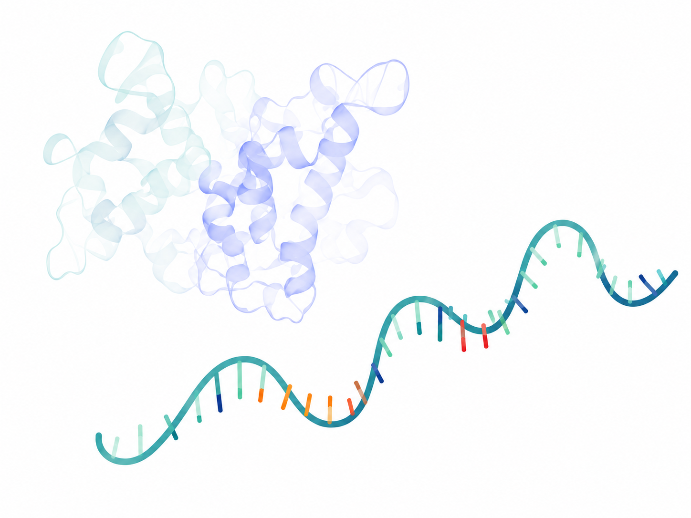
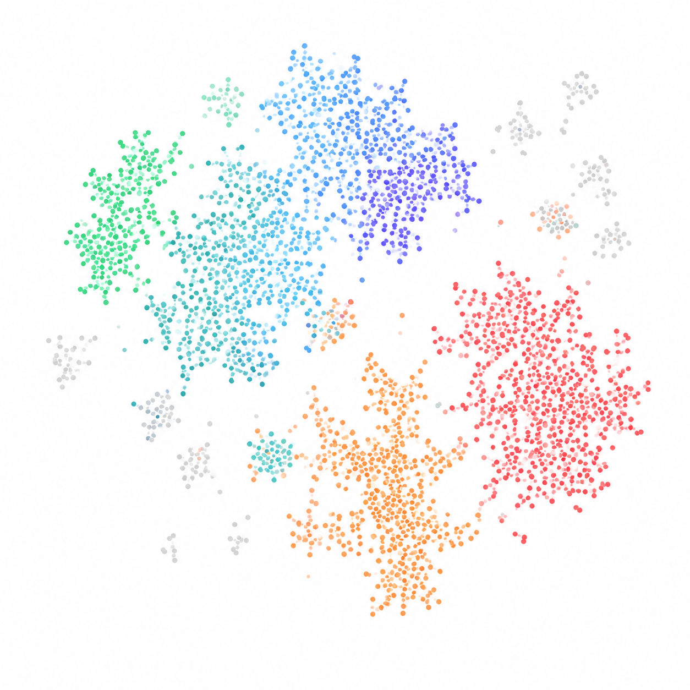

---
hide:
  - navigation
  - toc
  - footer
---

<section class="mtd-hero-v2">

  <!-- Left illustration -->

  

    

  

  <!-- Central content -->

  

    

    <h1 class="mtd-hero-v2-title">
      Explore the full depth of host–microbe interactions
      from RNA-seq data.
    </h1>

  MTD Explorer is an extended and actively developed implementation of the
  original Meta-Transcriptome Detector (MTD). It preserves the integrated
  analysis of host and microbial transcriptomes while adding expanded
  single-end and paired-end support, exploratory and comparison modes,
  custom host references and functional annotations, reusable installation
  caches, validation tools, and updated reporting.

  
    Original MTD:
  

  
    Wu, F., Liu, Y.-Z., &amp; Ling, B. (2022).
  

  <a
    href="https://doi.org/10.1093/bib/bbac111"
    target="_blank"
    rel="noopener noreferrer"
    class="mtd-origin-article"
  >
    <em>
      MTD: a unique pipeline for host and meta-transcriptome joint and
      integrative analyses of RNA-seq data
    </em>
  </a>.

  
    <em>Briefings in Bioinformatics</em>, 23(3), bbac111.
  

  

    <a
      href="https://doi.org/10.1093/bib/bbac111"
      target="_blank"
      rel="noopener noreferrer"
    >
      View article
    </a>

    ·

    <a
      href="https://github.com/FEI38750/MTD"
      target="_blank"
      rel="noopener noreferrer"
    >
      Original repository
    </a>

  

    

      <a
        href="getting-started/quick-start/"
        class="md-button md-button--primary"
      >
        Get started
      </a>

      <a
        href="getting-started/installation/"
        class="md-button"
      >
        View documentation
      </a>

    

  

  <!-- Right illustration -->

  

    

  

</section>

  <section class="mtd-cards-v2">

    <article class="mtd-card-v2">

      

        
      

      

        <h3>Host transcriptome</h3>

        

          Quantify host gene expression and isoforms with precision.
        

        <a href="user-guide/">
          Learn more →
        </a>
      

    </article>

    <article class="mtd-card-v2">

      

        
      

      

        <h3>Microbial community</h3>

        

          Profile microbial abundance and strain-level transcription.
        

        <a href="user-guide/">
          Learn more →
        </a>
      

    </article>

    <article class="mtd-card-v2">

      

        
      

      

        <h3>Functional activity</h3>

        

          Infer functional pathways and metabolic activity.
        

        <a href="user-guide/">
          Learn more →
        </a>
      

    </article>

    <article class="mtd-card-v2">

      

        
      

      

        <h3>Integrated exploration</h3>

        

          Jointly explore host, microbe, and function in one framework.
        

        <a href="user-guide/">
          Learn more →
        </a>
      

    </article>

  </section>

  <section class="mtd-workflow-v2">

    

      <h2>Workflow overview</h2>

      

        From raw reads to biological insights in five simple steps.
      

    

  

    
    <strong>1. Input data</strong>
    <small>RNA-seq reads and metadata</small>
  

  
→

  

    
    <strong>2. Process</strong>
    <small>Align, assemble &amp; quantify</small>
  

  
→

  

    
    <strong>3. Explore</strong>
    <small>Browse results &amp; visualize</small>
  

  
→

  

    
    <strong>4. Integrate</strong>
    <small>Combine host, microbe &amp; function</small>
  

  
→

  

    
    <strong>5. Interpret</strong>
    <small>Draw conclusions &amp; generate insights</small>
  

  </section>

