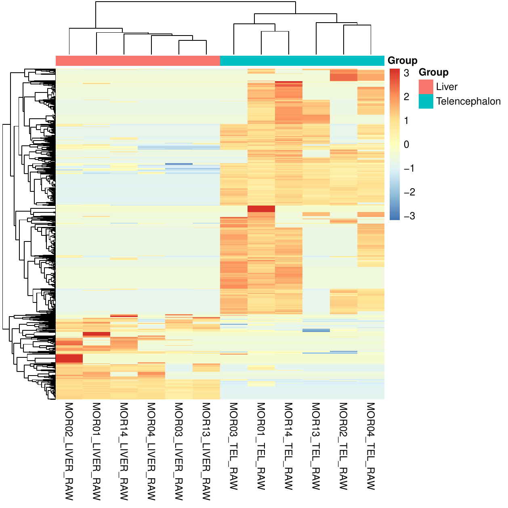
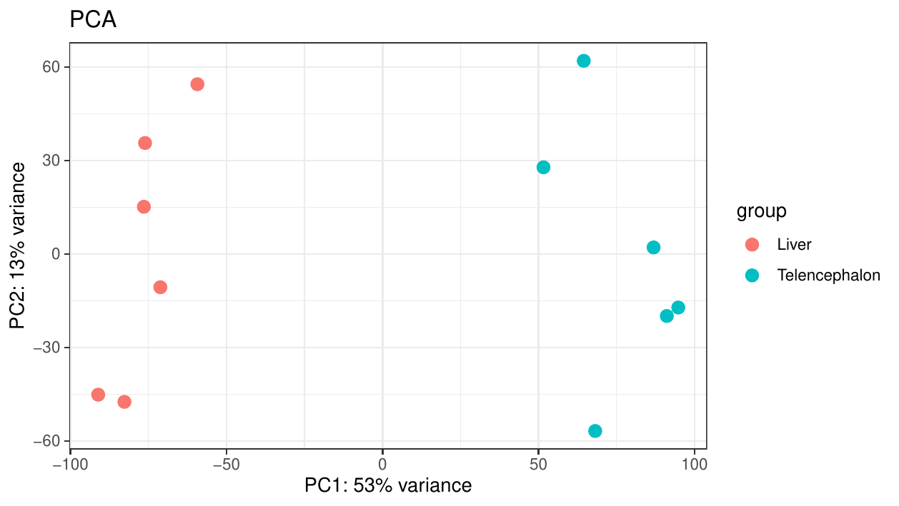
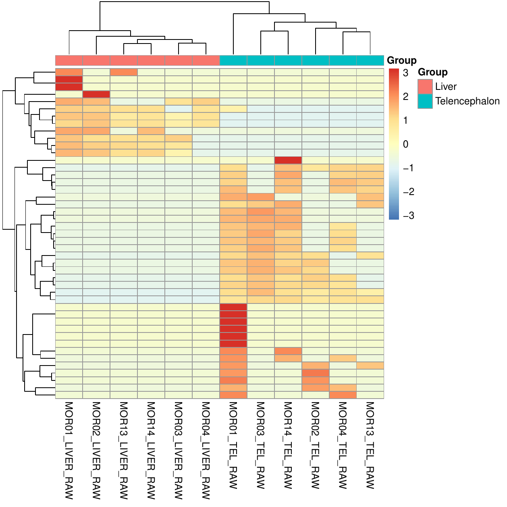
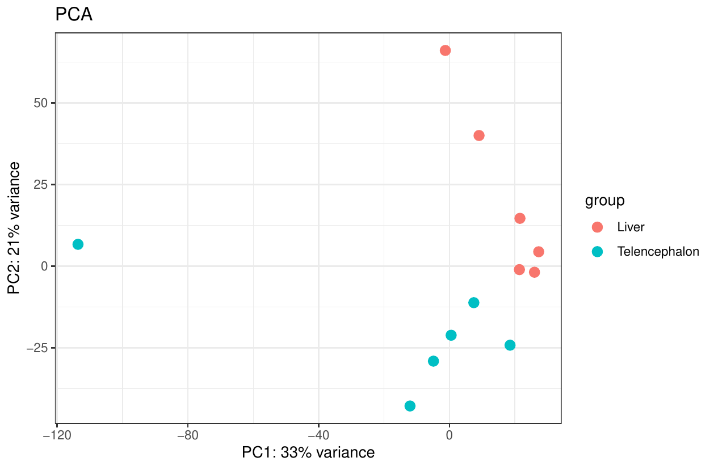

# Functional profiling outputs

This page describes the functional profiling outputs generated by
[MTD Explorer][mtd-explorer].

Functional profiling summarizes non-host gene-family profiles derived from
[HUMAnN][humann] and regrouped into [Gene Ontology][gene-ontology] and
[KEGG][kegg] annotations.

The main folder is:

```text
hmn_genefamily_abundance_files/Nonhost_hmn_DEG/
```

## Main folders

The functional outputs are usually split into two annotation layers:

```text
hmn_genefamily_abundance_files/Nonhost_hmn_DEG/GO/
hmn_genefamily_abundance_files/Nonhost_hmn_DEG/KEGG/
```

The `GO/` folder contains [Gene Ontology][gene-ontology] functional profiles.

The `KEGG/` folder contains [KEGG][kegg] functional profiles.

## GO functional heatmap

The compact GO heatmap is usually stored as:

```text
hmn_genefamily_abundance_files/Nonhost_hmn_DEG/GO/heatmap_thumbnail.pdf
```



This heatmap summarizes GO-level functional abundance patterns across samples.

It is useful for checking whether samples cluster by biological group and
whether a subset of GO terms dominates the functional signal.

The full heatmap may also be available as:

```text
hmn_genefamily_abundance_files/Nonhost_hmn_DEG/GO/heatmap.pdf
```

## GO functional PCA

The group-colored GO PCA is usually stored as:

```text
hmn_genefamily_abundance_files/Nonhost_hmn_DEG/GO/PCA_color.pdf
```



This PCA summarizes global variation in GO-level functional profiles.

Samples that cluster close together have more similar GO functional profiles.

Other PCA versions may also be present:

```text
hmn_genefamily_abundance_files/Nonhost_hmn_DEG/GO/PCA.pdf
hmn_genefamily_abundance_files/Nonhost_hmn_DEG/GO/PCA_label.pdf
hmn_genefamily_abundance_files/Nonhost_hmn_DEG/GO/PCA_label_color.pdf
```

## KEGG functional heatmap

The compact KEGG heatmap is usually stored as:

```text
hmn_genefamily_abundance_files/Nonhost_hmn_DEG/KEGG/heatmap_thumbnail.pdf
```



This heatmap summarizes KEGG-level functional abundance patterns across samples.

It provides a pathway-oriented view of the non-host functional profile.

The full heatmap may also be available as:

```text
hmn_genefamily_abundance_files/Nonhost_hmn_DEG/KEGG/heatmap.pdf
```

## KEGG functional PCA

The group-colored KEGG PCA is usually stored as:

```text
hmn_genefamily_abundance_files/Nonhost_hmn_DEG/KEGG/PCA_color.pdf
```



This PCA summarizes global variation in KEGG-level functional profiles.

It is useful for checking whether pathway-level profiles separate according to
the groups defined in the samplesheet.

Other PCA versions may also be present:

```text
hmn_genefamily_abundance_files/Nonhost_hmn_DEG/KEGG/PCA.pdf
hmn_genefamily_abundance_files/Nonhost_hmn_DEG/KEGG/PCA_label.pdf
hmn_genefamily_abundance_files/Nonhost_hmn_DEG/KEGG/PCA_label_color.pdf
```

## Differential functional outputs

Comparison-specific functional outputs may be stored in folders such as:

```text
hmn_genefamily_abundance_files/Nonhost_hmn_DEG/GO/Liver_vs_Telencephalon/
hmn_genefamily_abundance_files/Nonhost_hmn_DEG/KEGG/Liver_vs_Telencephalon/
```

These folders may contain:

```text
Barplot_Liver_vs_Telencephalon.pdf
Volcano_Liver_vs_Telencephalon.pdf
```

The standard volcano plots are not shown on this page because they can be
visually dense.

Future MTD Explorer versions may replace them with clearer enhanced volcano
plots.

## MaAsLin2 outputs

Some functional runs may also contain [MaAsLin2][maaslin2] outputs:

```text
hmn_genefamily_abundance_files/Nonhost_hmn_DEG/GO/MaAsLin2_results/
hmn_genefamily_abundance_files/Nonhost_hmn_DEG/KEGG/MaAsLin2_results/
```

Typical files include:

```text
all_results.tsv
significant_results.tsv
maaslin2.log
figures/
```

These files are useful for multivariable functional association analyses.

## Recommended inspection order

For functional profiling outputs, inspect:

```text
hmn_genefamily_abundance_files/
hmn_genefamily_abundance_files/Nonhost_hmn_DEG/GO/heatmap_thumbnail.pdf
hmn_genefamily_abundance_files/Nonhost_hmn_DEG/GO/PCA_color.pdf
hmn_genefamily_abundance_files/Nonhost_hmn_DEG/KEGG/heatmap_thumbnail.pdf
hmn_genefamily_abundance_files/Nonhost_hmn_DEG/KEGG/PCA_color.pdf
methods/mtd_methods_run_parameters.csv
```

## Interpretation notes

Functional profiling outputs can help show whether GO-level or KEGG-level
profiles cluster by group.

They can also highlight broad functional differences between sample groups.

Do not interpret PCA separation alone as proof of functional differential
abundance.

Do not interpret heatmap clustering without checking metadata, abundance
tables, taxonomic results, read depth, and database settings.

## When outputs may be missing

Functional profiling outputs may be missing when [HUMAnN][humann] did not
produce usable gene-family profiles, GO or KEGG regrouping failed, translated
tables were not generated, too few samples were available, or the abundance
matrix was too sparse.

## Related pages

- [Taxonomic exploratory outputs](taxonomic-exploratory-outputs.md)
- [Microbiome comparison outputs](microbiome-comparison-outputs.md)
- [Host expression outputs](host-expression-outputs.md)
- [Command-line reference](command-line.md)

[mtd-explorer]: https://github.com/patrick-douglas/MTD-Explorer
[humann]: https://github.com/biobakery/humann
[gene-ontology]: https://geneontology.org/
[kegg]: https://www.genome.jp/kegg/
[maaslin2]: https://huttenhower.sph.harvard.edu/maaslin/
