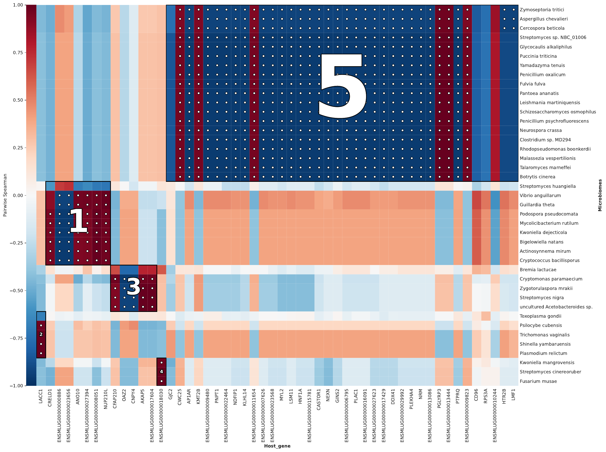
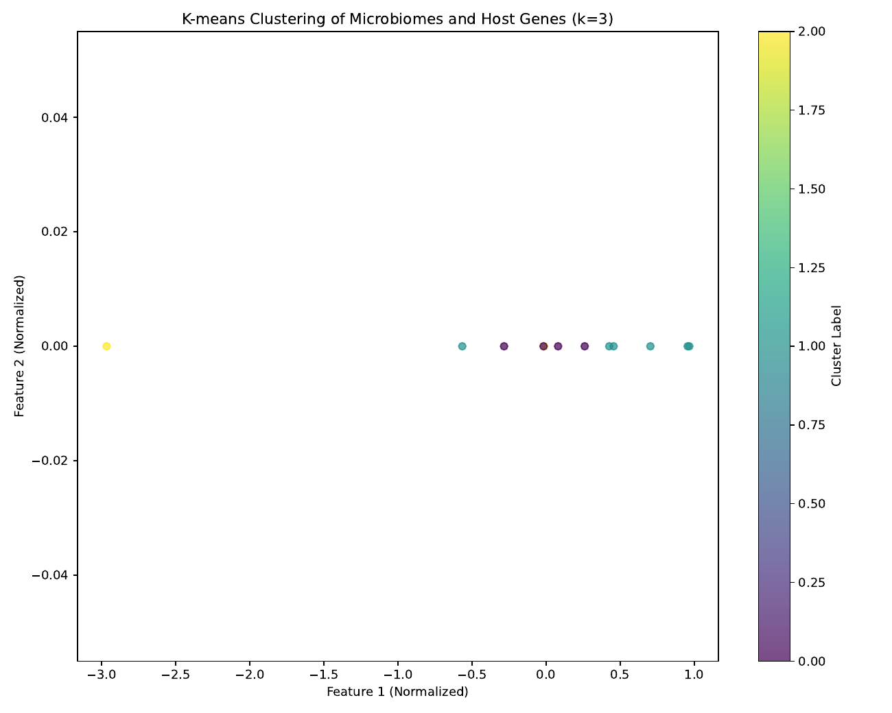
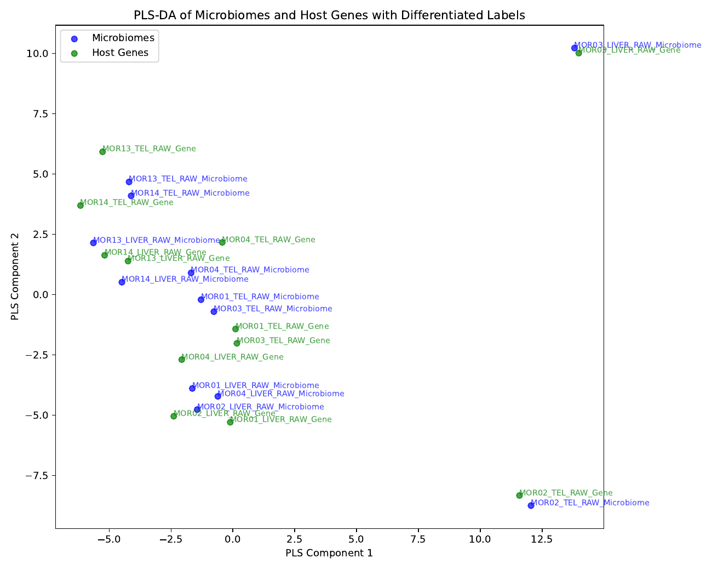

# HAllA integration outputs

This page describes the integration outputs generated by [MTD Explorer][mtd-explorer]
using [HAllA][halla].

[HAllA][halla] is used to identify associations between two high-dimensional
data layers.

In MTD Explorer, this step helps explore relationships between host-derived
features and microbiome or functional profiles.

The main folder is:

```text
halla/
```

## Main figures

The representative HAllA integration figures shown on this page are:

```text
halla/host_gene_hallagram_Top5.png
halla/kmeans_results.png
halla/pls_da_results.png
```

These figures summarize different views of the host-microbiome integration
analysis.

## Top HAllA associations

The main Hallagram figure shown here is:

```text
halla/host_gene_hallagram_Top5.png
```



This figure summarizes the top association patterns detected by [HAllA][halla].

It is useful for quickly identifying candidate relationships between host
features and non-host or functional features.

The figure should be treated as an exploratory association view.

It does not prove causality.

## K-means summary

The k-means summary figure is usually:

```text
halla/kmeans_results.png
```



This figure provides a clustering-oriented summary of the integrated feature
space.

It can help users inspect whether samples or features form recognizable
groups after integration.

Use this output as an exploratory visualization, not as a standalone statistical
test.

## PLS-DA summary

The PLS-DA summary figure is usually:

```text
halla/pls_da_results.png
```



This figure provides a supervised multivariate view of group separation.

It is useful for visual inspection of how integrated features relate to the
sample groups defined in the analysis.

PLS-DA results should be interpreted carefully, especially with small sample
sizes.

## Recommended inspection order

For HAllA integration outputs, inspect:

```text
halla/host_gene_hallagram_Top5.png
halla/kmeans_results.png
halla/pls_da_results.png
halla/
methods/mtd_methods_run_parameters.csv
```

The `methods/mtd_methods_run_parameters.csv` file records run settings and
software versions.

## What these outputs can support

HAllA integration outputs can help identify candidate associations between
host expression or host gene-set activity and microbiome or functional features.

They can also help prioritize feature pairs for biological interpretation.

## What not to conclude

Do not interpret HAllA associations as causal relationships.

Do not interpret visual separation in k-means or PLS-DA plots as proof of a
biological mechanism.

Do not interpret a top association without checking the underlying feature
tables, sample metadata, group labels, and study design.

## When outputs may be missing

HAllA outputs may be missing when one of the input matrices is unavailable,
when too few samples are available, when the matrices do not share matching
sample names, or when the association step fails but earlier pipeline steps
finish successfully.

## Related pages

- [Host expression outputs](host-expression-outputs.md)
- [Microbiome comparison outputs](microbiome-comparison-outputs.md)
- [Functional profiling outputs](functional-profiling-outputs.md)
- [ssGSEA outputs](ssgsea-outputs.md)
- [Command-line reference](command-line.md)

[mtd-explorer]: https://github.com/patrick-douglas/MTD-Explorer-Explorer
[halla]: https://github.com/biobakery/halla
