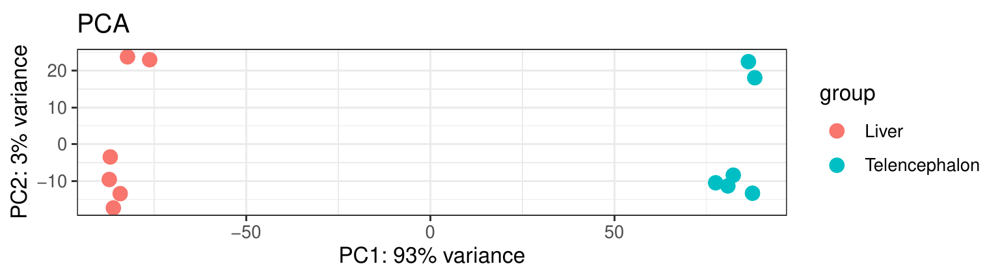
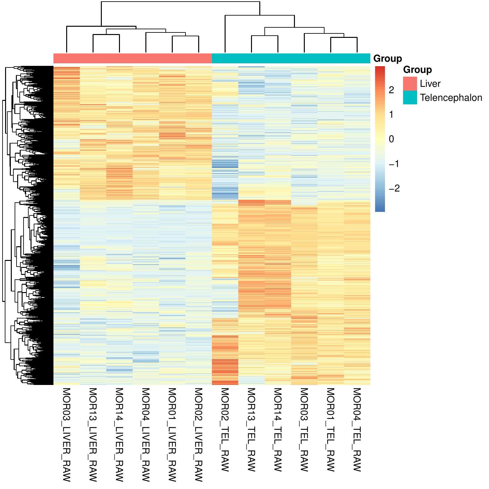
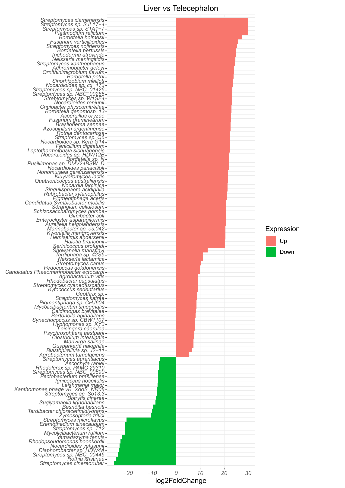
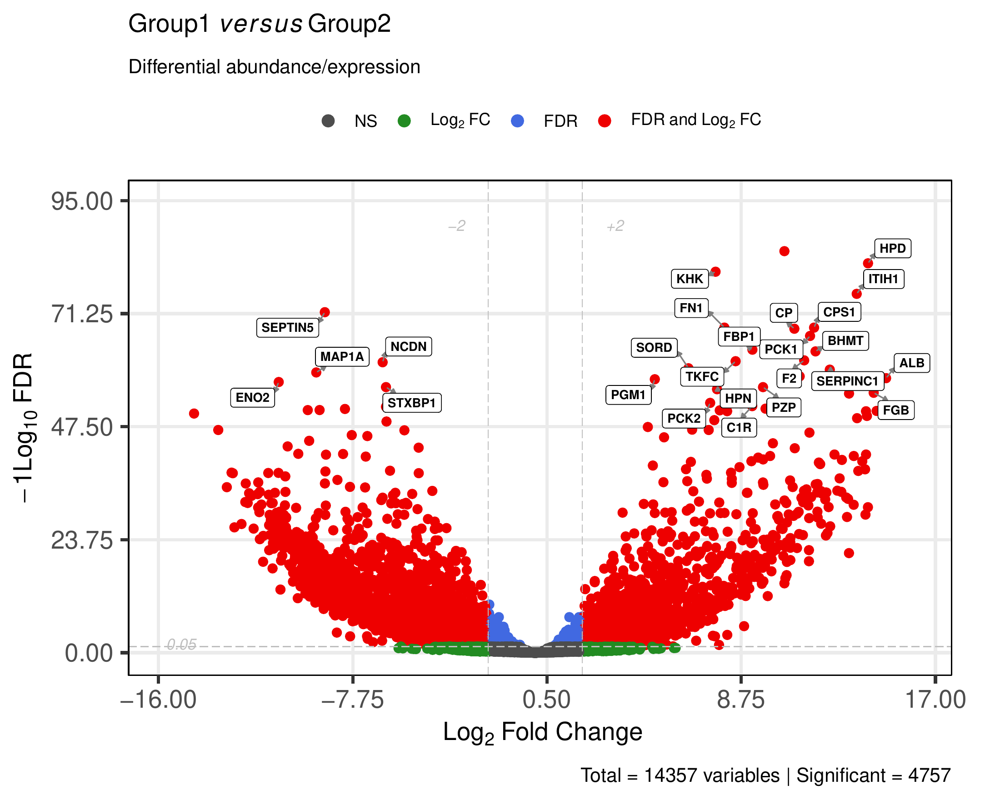
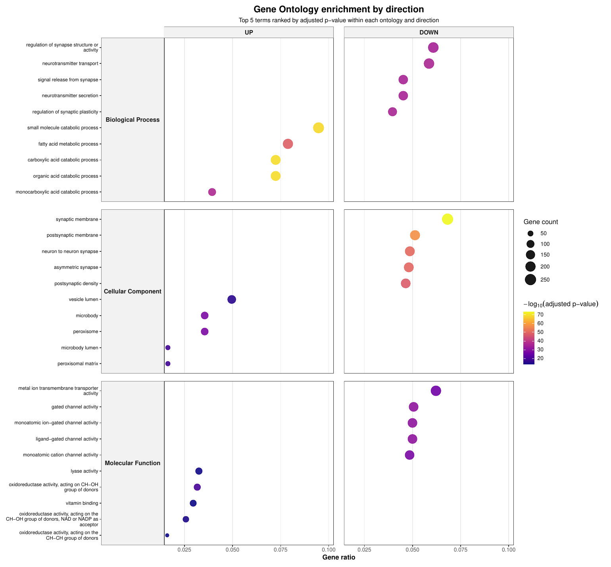

# Host expression outputs

This page describes the main host gene-expression outputs generated by
[MTD Explorer][mtd-explorer].

These outputs are produced when the workflow runs in comparison mode and host
gene counts are available.

The host expression block includes count matrices, normalized matrices,
principal component analysis plots, heatmaps, differential-expression tables,
volcano plots, and downstream functional interpretation outputs.

## Where these outputs are stored

The main host expression comparison outputs are stored in:

```text
Host_DEG/
```

Pairwise comparison-specific outputs are stored inside subdirectories such as:

```text
Host_DEG/Liver_vs_Telencephalon/
```

The exact comparison folder name depends on the group names in the samplesheet.

For example, if the comparison is liver versus telencephalon, the output folder
may be:

```text
Host_DEG/Liver_vs_Telencephalon/
```

## Main host expression files

A typical host expression output block contains files such as:

```text
host_counts.txt
Host_DEG/host_counts_DEG.csv
Host_DEG/host_counts_normalized.csv
Host_DEG/host_counts_normalized_transformed.csv
Host_DEG/host_counts_TPM.csv
Host_DEG/heatmap.pdf
Host_DEG/heatmap_thumbnail.pdf
Host_DEG/PCA.pdf
Host_DEG/PCA_label.pdf
Host_DEG/PCA_color.pdf
Host_DEG/PCA_label_color.pdf
```

For each comparison, [MTD Explorer][mtd-explorer] may also generate files such
as:

```text
Host_DEG/Liver_vs_Telencephalon/host_counts_Liver_vs_Telencephalon.csv
Host_DEG/Liver_vs_Telencephalon/host_counts_Liver_vs_Telencephalon_gene_symbols_table.csv
Host_DEG/Liver_vs_Telencephalon/Barplot_Liver_vs_Telencephalon.pdf
Host_DEG/Liver_vs_Telencephalon/host_counts_Liver_vs_Telencephalon_volcano.pdf
Host_DEG/Liver_vs_Telencephalon/host_counts_Liver_vs_Telencephalon.EV.volcano.log
```

## Host count matrices

The initial host count matrix is usually:

```text
host_counts.txt
```

This file contains host gene-level counts generated after host read alignment
and gene counting.

Depending on the selected host-processing mode, host reads may be aligned using
[HISAT2][hisat2] or [Magic-BLAST][magic-blast], and counted with
[featureCounts][featurecounts].

## Normalized and transformed matrices

The `Host_DEG/` directory usually contains processed host expression matrices:

```text
Host_DEG/host_counts_normalized.csv
Host_DEG/host_counts_normalized_transformed.csv
Host_DEG/host_counts_TPM.csv
```

These files are useful for downstream interpretation and visualization.

The `host_counts_TPM.csv` file is also used by later host functional-analysis
steps, including [ssGSEA][ssgsea].

## Differential expression table

The main differential expression table is usually:

```text
Host_DEG/host_counts_DEG.csv
```

For each pairwise comparison, [MTD Explorer][mtd-explorer] also writes a
comparison-specific table, for example:

```text
Host_DEG/Liver_vs_Telencephalon/host_counts_Liver_vs_Telencephalon.csv
```

This table contains the differential expression results for the selected
contrast.

A gene-symbol-enhanced table may also be generated:

```text
Host_DEG/Liver_vs_Telencephalon/host_counts_Liver_vs_Telencephalon_gene_symbols_table.csv
```

Use the comparison-specific table when inspecting genes associated with a
specific contrast.

Use the global `host_counts_DEG.csv` table when checking the full host DEG
summary generated for the run.

## PCA plots

[MTD Explorer][mtd-explorer] generates principal component analysis plots to
summarize global host expression variation among samples.

The main PCA files are:

```text
Host_DEG/PCA.pdf
Host_DEG/PCA_label.pdf
Host_DEG/PCA_color.pdf
Host_DEG/PCA_label_color.pdf
```

### Main PCA view



For documentation purposes, the main figure shown on this page is the
group-colored PCA plot.

This version is usually the clearest one for quickly checking whether samples
separate according to the biological groups defined in the samplesheet.

Samples that cluster close together have more similar global host expression
profiles.

Samples that separate strongly along the main principal components tend to have
larger global expression differences.

### Additional PCA variants

Other PCA versions may also be generated:

```text
Host_DEG/PCA.pdf
Host_DEG/PCA_label.pdf
Host_DEG/PCA_label_color.pdf
```

The `PCA_label_color.pdf` file is especially useful when you need to identify
individual samples or inspect possible outliers in more detail.

### How to interpret PCA

PCA is an exploratory visualization.

It can suggest whether the main source of expression variation matches the
experimental design.

However, PCA separation alone does not prove differential expression.

Always interpret PCA together with sample metadata, count depth,
differential-expression tables, and biological context.

## Host expression heatmaps

The main heatmap files are usually:

```text
Host_DEG/heatmap.pdf
Host_DEG/heatmap_thumbnail.pdf
```

### Heatmap thumbnail



For documentation purposes, the thumbnail heatmap is shown on this page because
the full heatmap can be too large for comfortable inline viewing.

The thumbnail provides a compact overview of sample clustering, gene
clustering, and broad host expression structure.

### Full heatmap

The complete heatmap is usually available in:

```text
Host_DEG/heatmap.pdf
```

Use the full heatmap when you need to inspect the expression structure in more
detail, especially for larger gene sets or when row labels are important.

## Differential expression summary bar plot

The comparison-specific bar plot is usually stored as:

```text
Host_DEG/Liver_vs_Telencephalon/Barplot_Liver_vs_Telencephalon.pdf
```

### Bar plot preview



For documentation purposes, a cropped preview of the upper part of the bar plot
is shown on this page.

This makes the figure easier to view inline while still providing a quick
overview of the differential expression summary.

### Full bar plot

The complete figure is usually available in:

```text
Host_DEG/Liver_vs_Telencephalon/Barplot_Liver_vs_Telencephalon.pdf
```

Use the full bar plot when you need to inspect all plotted categories in
detail.

This plot is useful for quickly checking the direction and scale of host
transcriptional differences between groups.

## Volcano plot

[MTD Explorer][mtd-explorer] generates an enhanced volcano plot for each host
differential-expression comparison using [EnhancedVolcano][enhancedvolcano].

For a comparison such as liver versus telencephalon, the enhanced volcano plot
is usually stored as:

```text
Host_DEG/Liver_vs_Telencephalon/host_counts_Liver_vs_Telencephalon_volcano.pdf
```



The volcano plot summarizes the differential expression results by combining
effect size and statistical support.

In general:

```text
Genes farther left or right have larger expression differences.
```

```text
Genes higher on the plot have stronger statistical support.
```

```text
Highlighted or labeled genes are useful candidates for closer inspection.
```

The corresponding log file is usually:

```text
Host_DEG/Liver_vs_Telencephalon/host_counts_Liver_vs_Telencephalon.EV.volcano.log
```

Use this log file if the enhanced volcano plot is missing, if gene labels do
not appear as expected, or if the plotting step produced warnings.

Some runs may also contain a standard volcano plot, such as:

```text
```

The standard volcano plot is retained as an output file, but the enhanced
volcano plot is usually clearer for documentation and interpretation.

## Gene annotation cache files

[MTD Explorer][mtd-explorer] may generate host gene annotation cache files in:

```text
Host_DEG/
```

Common files include:

```text
Host_DEG/gene_ID_cache.csv
Host_DEG/GID_to_ENTREZ_taxid_59463.tsv
```

These files help map host gene identifiers to gene symbols, Entrez IDs, gene
descriptions, and functional annotation terms.

They are especially useful when working with non-model organisms or custom host
annotation packages.

## Functional enrichment outputs

Host differential expression can be followed by functional interpretation using
[Gene Ontology][gene-ontology] and [KEGG][kegg] resources.

These outputs help summarize the biological themes associated with the host
differential-expression results.

### GO biological theme dotplot

The most compact host enrichment summary is usually:

```text
Host_DEG/biological_theme_comparison_GO_faceted_dotplot_top5.pdf
```

The corresponding source table is usually:

```text
Host_DEG/biological_theme_comparison_GO_faceted_dotplot_top5_data.csv
```

{ width="85%" }

This dotplot summarizes the top host [Gene Ontology][gene-ontology] themes
detected in the comparison.

It is useful as a compact overview because it avoids displaying the very large
set of individual enrichment and [GSEA][gsea] figures.

### Additional GO outputs

Additional [Gene Ontology][gene-ontology] outputs may also be generated in
`Host_DEG/`, including:

```text
Host_DEG/biological_theme_comparison_GO.pdf
Host_DEG/biological_theme_comparison_GO_results.csv
Host_DEG/biological_theme_comparison_GO_net.pdf
Host_DEG/biological_theme_comparison_GO_net_BP.pdf
Host_DEG/biological_theme_comparison_GO_net_BP_RETRY_top10.pdf
Host_DEG/biological_theme_comparison_GO_net_CC.pdf
Host_DEG/biological_theme_comparison_GO_net_CC_RETRY_top10.pdf
Host_DEG/biological_theme_comparison_GO_net_MF.pdf
Host_DEG/biological_theme_comparison_GO_net_MF_RETRY_top10.pdf
```

These files are useful for detailed inspection, but they can be visually dense.

For documentation purposes, this page shows only the compact faceted dotplot.

### Additional KEGG outputs

[KEGG][kegg] pathway-level summaries may also be generated, such as:

```text
Host_DEG/biological_theme_comparison_KEGG_derived_PATHWAY.pdf
Host_DEG/biological_theme_comparison_KEGG_derived_PATHWAY_results.csv
Host_DEG/biological_theme_comparison_KEGG_derived_PATHWAY_net.pdf
```

These outputs are useful for pathway interpretation and should be inspected
together with the DEG tables and GO results.

### Per-comparison enrichment folders

Comparison-specific enrichment outputs are usually stored in folders such as:

```text
Host_DEG/Liver_vs_Telencephalon/GO/
Host_DEG/Liver_vs_Telencephalon/KEGG/
```

These folders may contain enrichment tables, dot plots, network plots, tree
plots, upset plots, and per-term [GSEA][gsea] figures.

The `GSEA_all/` folder can contain many individual term-level plots.

Those files are best treated as detailed supplementary outputs rather than
inline documentation figures.

### How to interpret enrichment outputs

Functional enrichment outputs help answer questions such as:

```text
Which biological processes are overrepresented among host DEGs?
```

```text
Which molecular functions or cellular components are associated with the
comparison?
```

```text
Which pathways summarize the strongest host transcriptional differences?
```

Do not interpret enriched terms as direct proof of mechanism.

Use them as biological summaries that should be checked against the DEG table,
gene annotations, expression direction, and study design.

## Host expression matrix QC outputs

In some runs, [MTD Explorer][mtd-explorer] may also generate exploratory host
expression matrix QC outputs under:

```text
exploratory/host_expression/
```

Typical files may include:

```text
host_expression_pca.png
host_expression_top_variable_heatmap.png
host_expression_sample_correlation_heatmap.png
host_expression_detected_features_per_sample.png
```

These outputs are descriptive QC plots for the host count matrix.

They may be absent in older runs, comparison-only legacy outputs, or runs where
the host matrix QC step was skipped.

## Recommended inspection order

For a host expression comparison, inspect files in this order:

```text
host_counts.txt
Host_DEG/host_counts_TPM.csv
Host_DEG/PCA_color.pdf
Host_DEG/PCA_label_color.pdf
Host_DEG/heatmap.pdf
Host_DEG/host_counts_DEG.csv
Host_DEG/Liver_vs_Telencephalon/host_counts_Liver_vs_Telencephalon.csv
Host_DEG/Liver_vs_Telencephalon/host_counts_Liver_vs_Telencephalon_volcano.pdf
Host_DEG/Liver_vs_Telencephalon/GO/
Host_DEG/Liver_vs_Telencephalon/KEGG/
methods/mtd_methods_run_parameters.csv
```

The `methods/mtd_methods_run_parameters.csv` file is useful because it records
important run settings, database paths, host ID, alignment mode, gene-counting
settings, and software versions.

## What these outputs can support

Host expression outputs can help answer questions such as:

```text
Do host samples cluster according to the experimental design?
```

```text
Which host genes differ between groups?
```

```text
Which genes have the largest effect sizes?
```

```text
Which Gene Ontology terms or KEGG pathways are enriched?
```

```text
Are host transcriptional differences consistent with microbiome or functional
profiles?
```

## What not to conclude

Do not interpret PCA separation as proof of differential expression.

Do not interpret a volcano plot without checking the underlying table.

Do not treat gene labels in a figure as the complete list of relevant genes.

Do not interpret enriched terms as direct proof of mechanism.

Do not compare host DEG results across runs unless the reference genome,
annotation, filtering, normalization, and statistical settings are comparable.

## When outputs may be missing

Host expression outputs may be absent or incomplete when:

- host reads were not detected;
- host alignment failed;
- gene counting failed;
- the host annotation file was missing or incompatible;
- the samplesheet did not contain valid comparison groups;
- the run was executed in exploratory mode;
- the differential-expression step failed;
- the enhanced volcano step failed but the main pipeline continued;
- too few samples were available for the requested comparison.

If `exploratory/host_expression/` is missing but `Host_DEG/` exists, the run
still contains host comparison outputs.

If `Host_DEG/` is missing, the run likely did not complete the host DEG block
or was executed without comparison-mode host differential expression.

## Related pages

- [Output files](output-files.md)
- [Taxonomic exploratory outputs](taxonomic-exploratory-outputs.md)
- [Taxonomic visualizations](taxonomic-visualizations.md)
- [Command-line reference](command-line.md)

[mtd-explorer]: https://github.com/patrick-douglas/MTD
[hisat2]: https://daehwankimlab.github.io/hisat2/
[magic-blast]: https://ncbi.github.io/magicblast/
[featurecounts]: https://subread.sourceforge.net/featureCounts.html
[deseq2]: https://bioconductor.org/packages/DESeq2/
[enhancedvolcano]: https://bioconductor.org/packages/EnhancedVolcano/
[gene-ontology]: https://geneontology.org/
[kegg]: https://www.genome.jp/kegg/
[gsea]: https://www.gsea-msigdb.org/gsea/index.jsp
[ssgsea]: https://gsea-msigdb.github.io/ssGSEA-gpmodule/v10/
