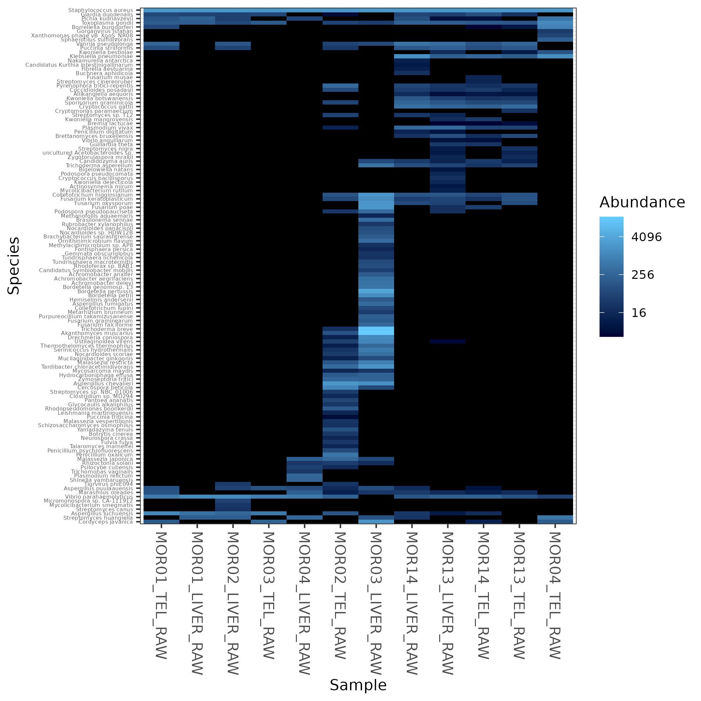
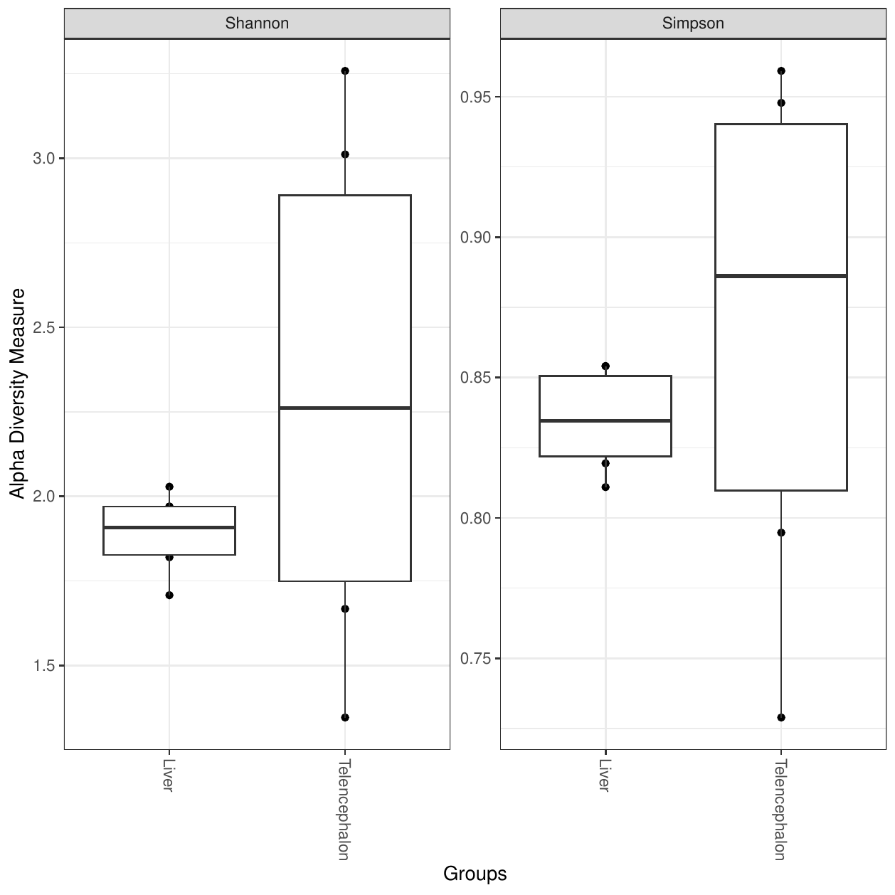
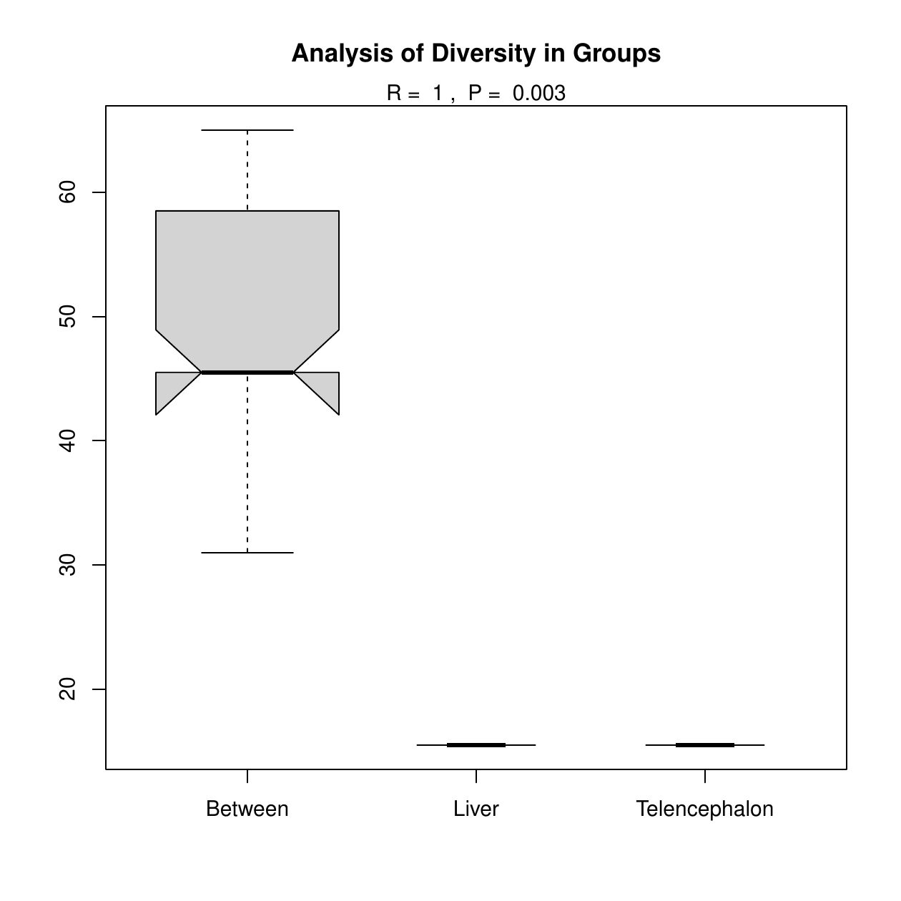
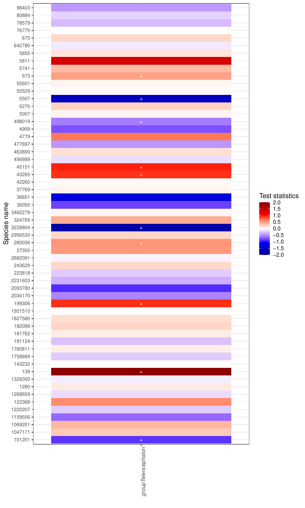
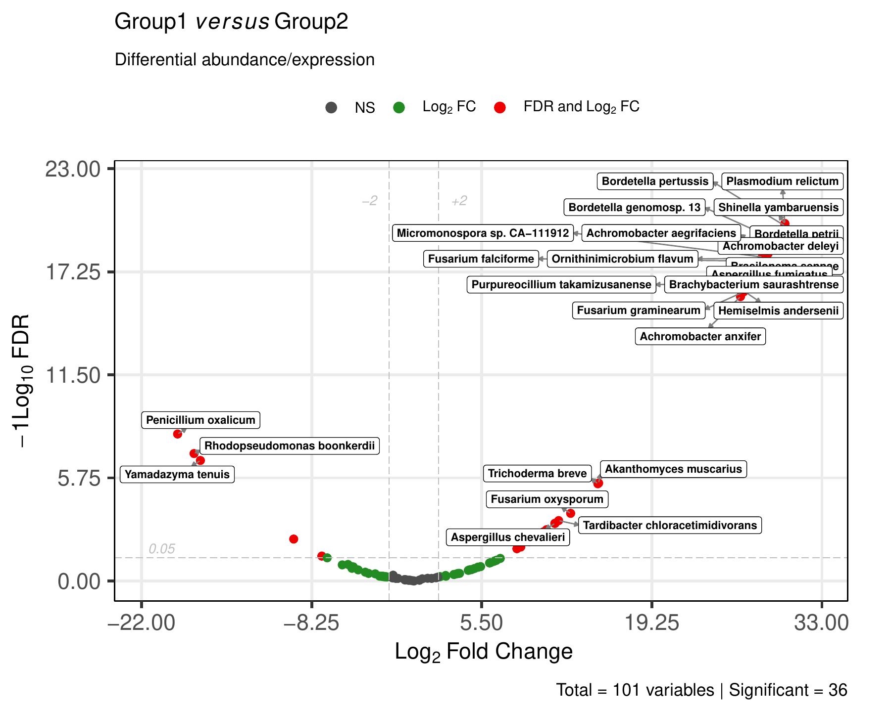

# Microbiome comparison outputs

This page describes the microbiome comparison outputs generated by
[MTD Explorer][mtd-explorer].

These outputs are produced when comparison groups are available and microbiome
abundance profiles can be compared between conditions.

The main microbiome comparison folder is:

```text
Nonhost_DEG/
```

Despite the historical folder name, this directory stores microbiome and
non-host comparison outputs, including [Bracken][bracken] abundance matrices,
diversity plots, differential-abundance results, and statistical summaries.

## Main output files

A typical `Nonhost_DEG/` folder may contain:

```text
Nonhost_DEG/bracken_species_all_DEG.csv
Nonhost_DEG/bracken_species_all_normalized.csv
Nonhost_DEG/bracken_species_all_normalized_transformed.csv
Nonhost_DEG/braycurtis.csv
Nonhost_DEG/braycurtis-pcoa.csv
Nonhost_DEG/Heatmap_all.png
Nonhost_DEG/Alpha_diversity.pdf
Nonhost_DEG/ANOSIM.pdf
Nonhost_DEG/ANOSIM-analysis-output.txt
```

Pairwise comparison outputs are usually stored in folders such as:

```text
Nonhost_DEG/Liver_vs_Telencephalon/
```

## Microbiome abundance heatmap

The global microbiome heatmap is usually stored as:

```text
Nonhost_DEG/Heatmap_all.png
```



This heatmap summarizes microbiome abundance patterns across samples and taxa.

It helps users inspect whether samples cluster by experimental group and
whether a small number of taxa dominate the comparison.

Use this figure together with the normalized [Bracken][bracken] matrices and
sample metadata.

## Alpha diversity comparison

The main alpha diversity figure is usually:

```text
Nonhost_DEG/Alpha_diversity.pdf
```



Alpha diversity summarizes within-sample microbiome diversity.

This output helps compare whether groups differ in their overall microbiome
diversity.

Additional alpha diversity files may also be present:

```text
Nonhost_DEG/Alpha_diversity_sample.pdf
Nonhost_DEG/Alpha_diversity_Shannon.pdf
Nonhost_DEG/Alpha_diversity_Simpson.pdf
Nonhost_DEG/alpha-diversity.csv
```

Use the CSV file when you need the underlying values for reporting or further
statistical inspection.

## Beta diversity and ANOSIM

The [ANOSIM][anosim] output is usually stored as:

```text
Nonhost_DEG/ANOSIM.pdf
Nonhost_DEG/ANOSIM-analysis-output.txt
```



[ANOSIM][anosim] evaluates whether microbiome community composition differs
between groups based on a distance matrix.

Related files may include:

```text
Nonhost_DEG/braycurtis.csv
Nonhost_DEG/braycurtis-pcoa.csv
```

The `braycurtis.csv` file stores the Bray-Curtis distance matrix.

The `braycurtis-pcoa.csv` file stores coordinates used for ordination-based
inspection.

ANOSIM should be interpreted as a community-level test, not as evidence that a
specific taxon is differentially abundant.

## Differential abundance with ANCOM-BC

[ANCOM-BC][ancombc] results are usually stored in:

```text
Nonhost_DEG/ANCOMBC_results/
```

The version with species names is usually easier to inspect:

```text
Nonhost_DEG/ANCOMBC_results/with_species_names/
```

The main heatmap is usually:

```text
Nonhost_DEG/ANCOMBC_results/with_species_names/heatmap_ANCOMBC.pdf
```



Common [ANCOM-BC][ancombc] result tables include:

```text
Nonhost_DEG/ANCOMBC_results/with_species_names/diff_abundance_name.csv
Nonhost_DEG/ANCOMBC_results/with_species_names/p_value_name.csv
Nonhost_DEG/ANCOMBC_results/with_species_names/q_value_name.csv
Nonhost_DEG/ANCOMBC_results/with_species_names/Test_statistics_name.csv
Nonhost_DEG/ANCOMBC_results/with_species_names/Global_test_name.csv
```

Use the CSV files for interpretation and reporting.

The heatmap is a compact visualization, but the tables are the source of the
statistical results.

## Microbiome volcano plot

[MTD Explorer][mtd-explorer] may generate a microbiome volcano plot from the
comparison-specific [Bracken][bracken] differential-abundance table.

The preferred output is usually generated from a file matching:

```text
Nonhost_DEG/*/bracken_species_all_*_volcano.pdf
```



The volcano plot summarizes effect size and statistical support for
comparison-level microbiome features.

Genes are not shown here; this plot refers to microbiome taxa or features from
the [Bracken][bracken] abundance table.

Some runs may also contain a standard volcano plot, such as:

```text
Nonhost_DEG/Liver_vs_Telencephalon/Volcano_Liver_vs_Telencephalon.pdf
```

Use the comparison-specific CSV file for the underlying results:

```text
Nonhost_DEG/Liver_vs_Telencephalon/bracken_species_all_Liver_vs_Telencephalon.csv
```

## Additional microbiome comparison outputs

Other microbiome comparison figures may also be generated:

```text
Nonhost_DEG/Bar_phy.pdf
Nonhost_DEG/Bar_group_phy.pdf
Nonhost_DEG/Bar_relative_phy.pdf
Nonhost_DEG/non-host_vs_host_reads_ratio.pdf
Nonhost_DEG/unclassified_reads_ratio.pdf
```

These outputs can be useful for detailed inspection, but they may be visually
dense.

Presence/absence overlap visualizations are documented in the
[Taxonomic exploratory outputs](taxonomic-exploratory-outputs.md) page, where
the Venn and Euler diagrams provide a clearer exploratory overview.

For documentation purposes, this page shows a smaller set of representative
comparison figures.

## MaAsLin2 outputs

Some runs may also contain [MaAsLin2][maaslin2] outputs, usually under:

```text
Nonhost_DEG/MaAsLin2_results/
```

Typical files may include:

```text
Nonhost_DEG/MaAsLin2_results/ref_Telencephalon/all_results.tsv
Nonhost_DEG/MaAsLin2_results/ref_Telencephalon/significant_results.tsv
Nonhost_DEG/MaAsLin2_results/ref_Telencephalon/maaslin2.log
```

Use these files when interpreting multivariable microbiome associations.

## Recommended inspection order

For microbiome comparisons, inspect files in this order:

```text
Nonhost_DEG/bracken_species_all_normalized.csv
Nonhost_DEG/Heatmap_all.png
Nonhost_DEG/Alpha_diversity.pdf
Nonhost_DEG/ANOSIM-analysis-output.txt
Nonhost_DEG/ANCOMBC_results/with_species_names/diff_abundance_name.csv
Nonhost_DEG/ANCOMBC_results/with_species_names/q_value_name.csv
Nonhost_DEG/Liver_vs_Telencephalon/bracken_species_all_Liver_vs_Telencephalon.csv
methods/mtd_methods_run_parameters.csv
```

The `methods/mtd_methods_run_parameters.csv` file records the database paths,
taxonomic settings, [Kraken2][kraken2] parameters, [Bracken][bracken]
parameters, and software versions.

## What these outputs can support

Microbiome comparison outputs can help answer whether microbiome profiles
cluster by group, whether groups differ in alpha diversity, whether overall
community composition differs, and which taxa are differentially abundant.

## What not to conclude

Do not interpret a visual cluster as proof of group separation by itself.

Do not interpret a Venn diagram as differential abundance.

Do not interpret a volcano plot without checking the corresponding result
table.

Do not interpret a taxon as biologically important only because it is visually
prominent.

Do not compare microbiome results across runs unless the database, taxonomic
rank, filtering, normalization, and statistical settings are comparable.

## When outputs may be missing

Microbiome comparison outputs may be missing or incomplete when:

- no non-host taxa were detected;
- the [Bracken][bracken] abundance table is missing;
- too few samples are available;
- the samplesheet does not contain valid comparison groups;
- the matrix is too sparse;
- [ANCOM-BC][ancombc] or [MaAsLin2][maaslin2] failed;
- the volcano step failed but the pipeline continued;
- a plotting step failed after the main tables were generated.

## Related pages

- [Taxonomic exploratory outputs](taxonomic-exploratory-outputs.md)
- [Taxonomic visualizations](taxonomic-visualizations.md)
- [Host expression outputs](host-expression-outputs.md)
- [Command-line reference](command-line.md)

[mtd-explorer]: https://github.com/patrick-douglas/MTD-Explorer-Explorer
[kraken2]: https://ccb.jhu.edu/software/kraken2/index.shtml
[bracken]: https://github.com/jenniferlu717/Bracken
[ancombc]: https://bioconductor.org/packages/ANCOMBC/
[anosim]: https://vegandevs.github.io/vegan/reference/anosim.html
[maaslin2]: https://huttenhower.sph.harvard.edu/maaslin/
