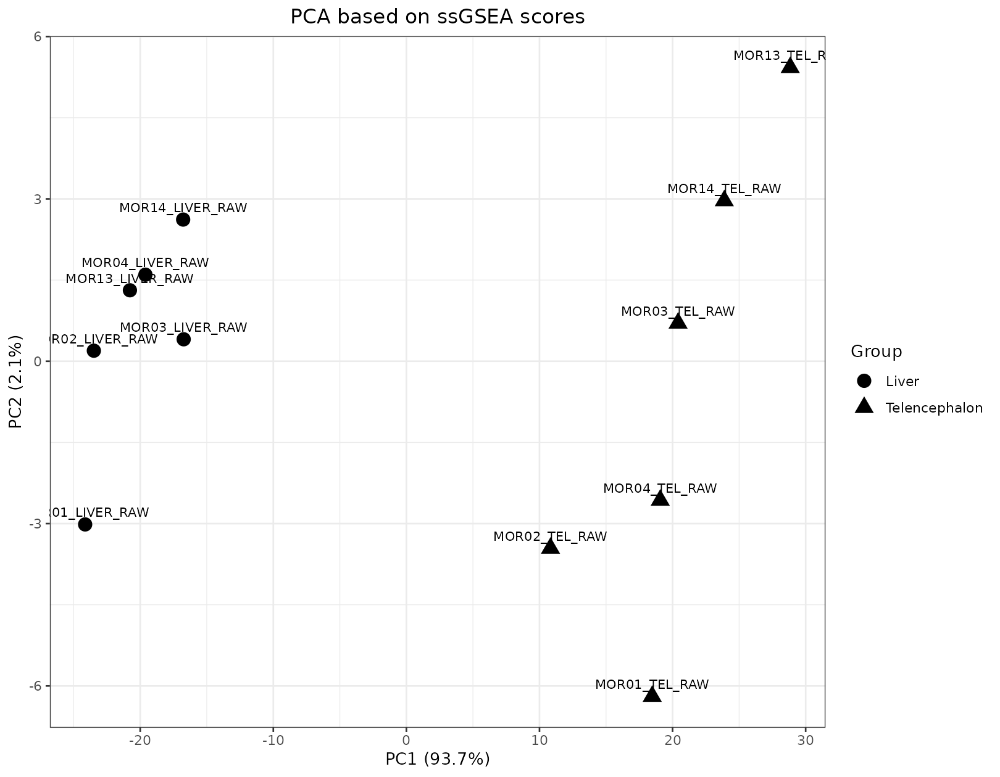
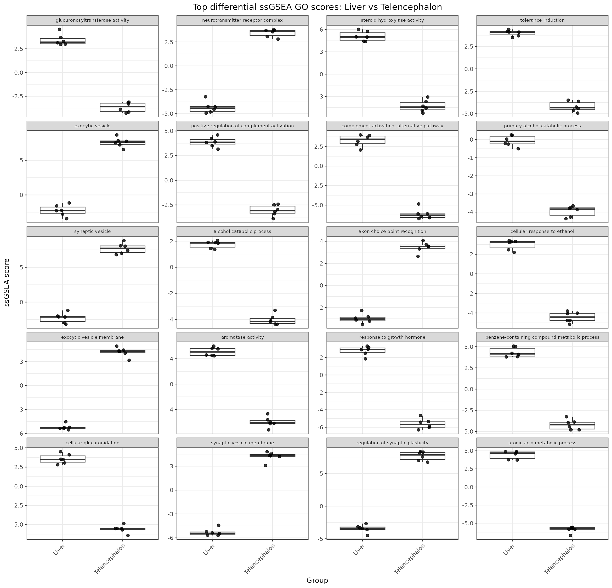
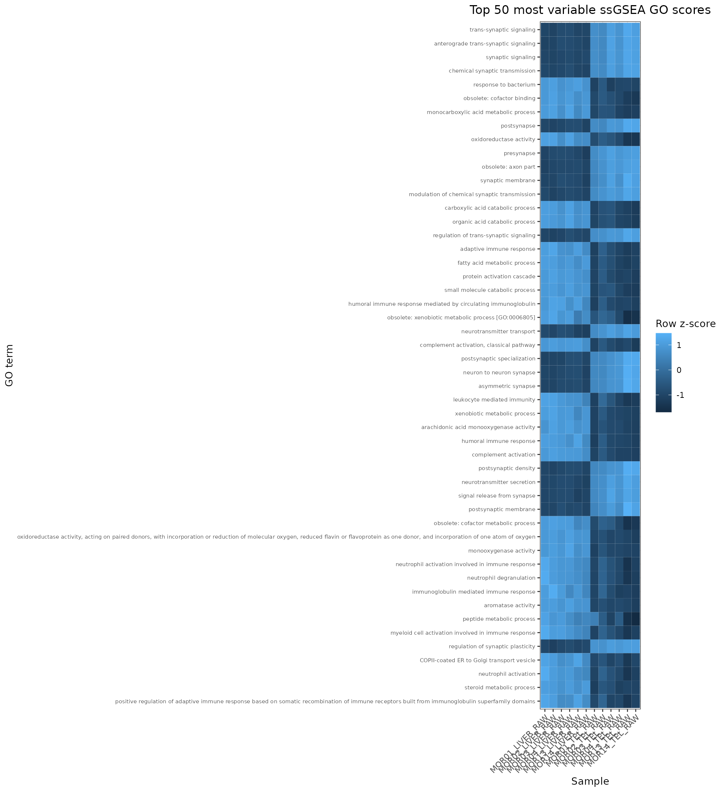
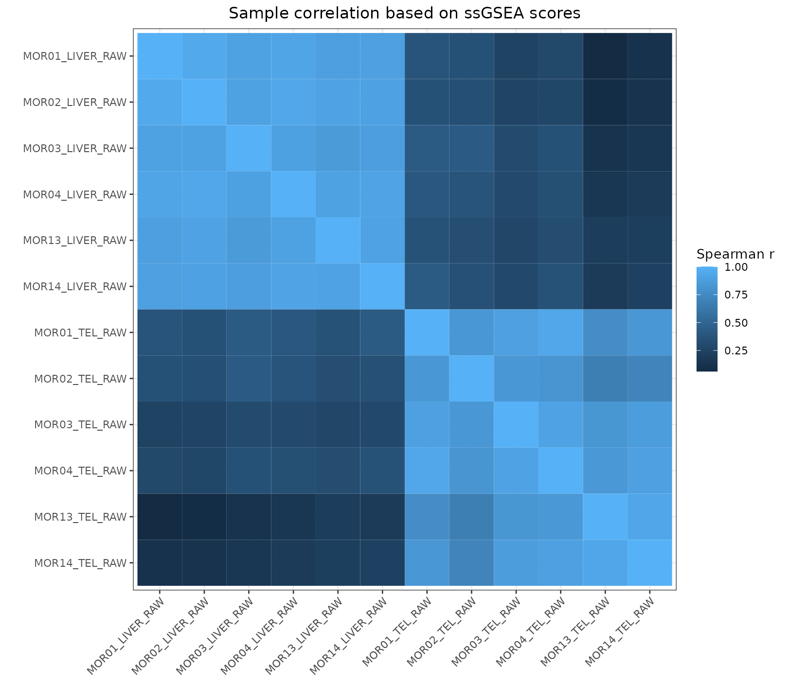
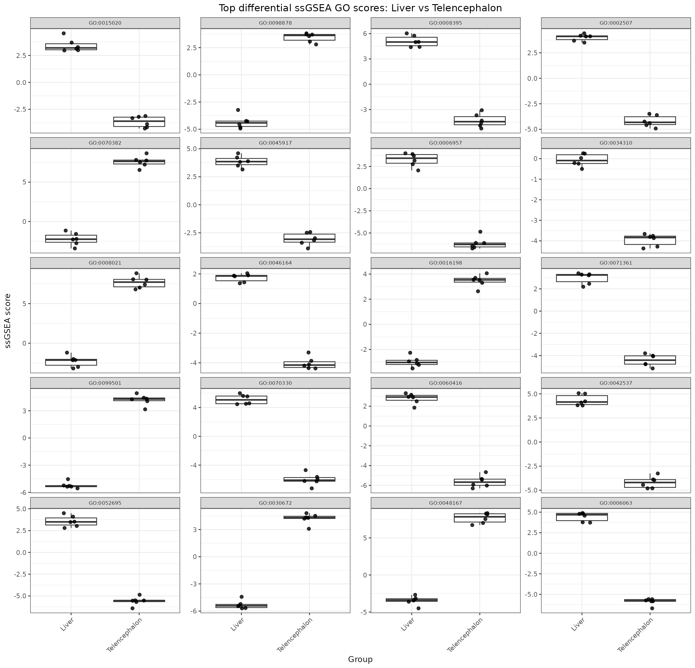
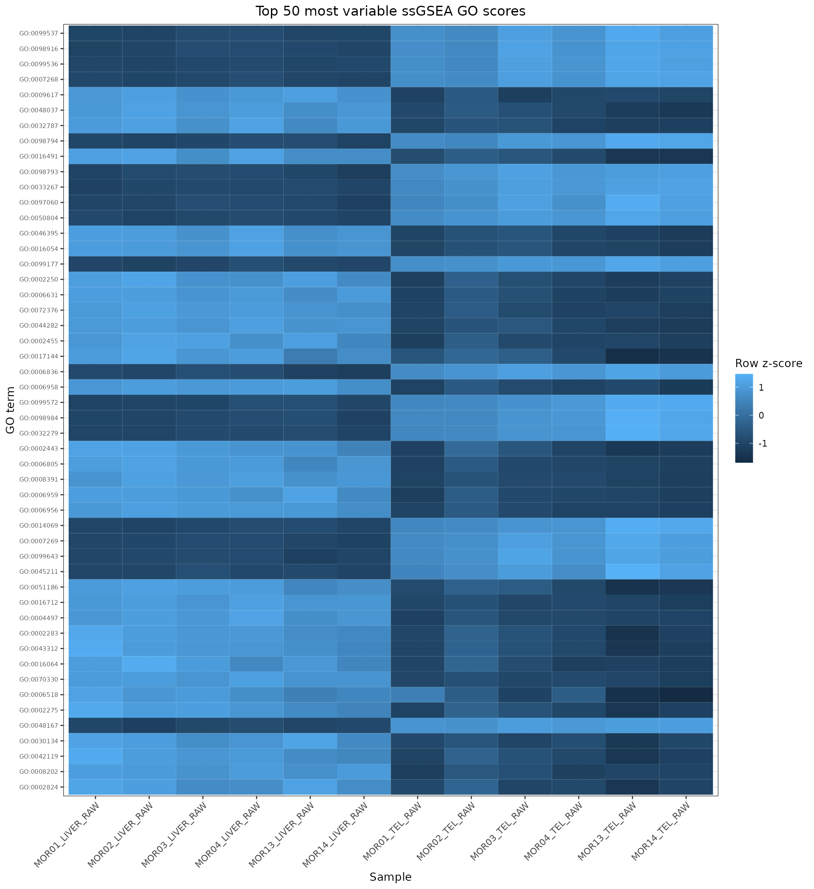

# ssGSEA outputs

This page describes the single-sample gene set enrichment outputs generated by
[MTD Explorer][mtd-explorer].

[ssGSEA][ssgsea] summarizes gene set activity at the sample level.

In MTD Explorer, these outputs help inspect whether host gene-set activity
differs across biological groups.

The main folder is:

```text
ssGSEA/
```

## Main ssGSEA figures

A typical `ssGSEA/` folder may contain:

```text
plots_GO_names_ssGSEA_PCA_samples.png
plots_GO_names_ssGSEA_sample_correlation_heatmap.png
plots_GO_names_ssGSEA_top_differential_boxplots.png
plots_GO_names_ssGSEA_top_variable_heatmap.png
plots_ssGSEA_PCA_samples.png
plots_ssGSEA_sample_correlation_heatmap.png
plots_ssGSEA_top_differential_boxplots.png
plots_ssGSEA_top_variable_heatmap.png
```

The two PCA figures can be visually identical in some runs.

For documentation purposes, this page shows one representative PCA figure.

## ssGSEA PCA

The representative PCA figure is usually:

```text
ssGSEA/plots_GO_names_ssGSEA_PCA_samples.png
```



This PCA summarizes global variation in sample-level gene-set activity.

Samples that cluster close together have more similar ssGSEA profiles.

Samples that separate strongly along the main principal components have larger
global gene-set activity differences.

PCA is exploratory and should be interpreted together with sample metadata,
gene-set definitions, and the underlying ssGSEA score matrix.

## GO-name ssGSEA sample correlation heatmap

The GO-name sample correlation heatmap is usually:

```text
ssGSEA/plots_GO_names_ssGSEA_sample_correlation_heatmap.png
```


This heatmap shows similarity among samples based on their ssGSEA profiles.

It is useful for checking whether samples from the same group have similar
gene-set activity patterns.

## GO-name ssGSEA top differential boxplots

The GO-name top differential boxplot figure is usually:

```text
ssGSEA/plots_GO_names_ssGSEA_top_differential_boxplots.png
```



This figure summarizes selected gene sets with stronger group-level differences.

It is useful for quickly identifying which gene sets may drive differences
between biological groups.

Use the corresponding tables for statistical interpretation.

## GO-name ssGSEA top variable heatmap

The GO-name top variable heatmap is usually:

```text
ssGSEA/plots_GO_names_ssGSEA_top_variable_heatmap.png
```



This heatmap shows the most variable GO-named ssGSEA features across samples.

It helps identify gene sets with strong sample-to-sample variation.

## ssGSEA sample correlation heatmap

The sample correlation heatmap is usually:

```text
ssGSEA/plots_ssGSEA_sample_correlation_heatmap.png
```



This figure provides an alternative sample-level correlation view using the
ssGSEA feature labels generated by the pipeline.

## ssGSEA top differential boxplots

The top differential boxplot figure is usually:

```text
ssGSEA/plots_ssGSEA_top_differential_boxplots.png
```



This figure highlights selected ssGSEA features that differ between groups.

It is useful as a visual summary, but statistical conclusions should be based
on the output tables.

## ssGSEA top variable heatmap

The top variable heatmap is usually:

```text
ssGSEA/plots_ssGSEA_top_variable_heatmap.png
```



This heatmap summarizes the most variable ssGSEA features across samples.

It can help identify gene-set activity patterns that separate samples or reveal
possible outliers.

## Recommended inspection order

For ssGSEA outputs, inspect:

```text
ssGSEA/plots_GO_names_ssGSEA_PCA_samples.png
ssGSEA/plots_GO_names_ssGSEA_sample_correlation_heatmap.png
ssGSEA/plots_GO_names_ssGSEA_top_variable_heatmap.png
ssGSEA/plots_GO_names_ssGSEA_top_differential_boxplots.png
ssGSEA/plots_ssGSEA_sample_correlation_heatmap.png
ssGSEA/plots_ssGSEA_top_variable_heatmap.png
ssGSEA/plots_ssGSEA_top_differential_boxplots.png
methods/mtd_methods_run_parameters.csv
```

The `methods/mtd_methods_run_parameters.csv` file records run settings and
software versions.

## What these outputs can support

ssGSEA outputs can help answer whether host gene-set activity profiles cluster
by group.

They can also help identify gene sets with strong variation across samples or
large group-level differences.

## What not to conclude

Do not interpret PCA separation alone as proof of differential gene-set
activity.

Do not interpret heatmap clustering without checking metadata and the underlying
ssGSEA score matrix.

Do not interpret a boxplot as final statistical evidence without checking the
corresponding tables and the study design.

## When outputs may be missing

ssGSEA outputs may be missing when host expression matrices are unavailable,
gene identifiers cannot be mapped to gene sets, too few samples are available,
or the ssGSEA score matrix is too sparse for plotting.

## Related pages

- [Host expression outputs](host-expression-outputs.md)
- [Functional profiling outputs](functional-profiling-outputs.md)
- [Microbiome comparison outputs](microbiome-comparison-outputs.md)
- [Command-line reference](command-line.md)

[mtd-explorer]: https://github.com/patrick-douglas/MTD-Explorer
[ssgsea]: https://gsea-msigdb.github.io/ssGSEA-gpmodule/v10/
