# Taxonomic exploratory outputs

This page explains the taxonomic exploratory outputs generated by
[MTD Explorer][mtd-explorer].

These outputs help users inspect taxonomic profiles, identify dominant or
recurrent taxa, evaluate sample-level patterns, and detect unusual
classification behavior before formal interpretation.

They are descriptive outputs. They should not be interpreted as statistical
tests of differential abundance.

## Where these outputs are stored

Taxonomic exploratory outputs are stored in:

```text
exploratory/taxonomy/
```

The main folders are:

```text
exploratory/taxonomy/
├── heatmap/
├── stacked_bar/
├── prevalence_abundance/
├── detected_microbiome/
├── detected_microbiome_extracted_reads/
├── core_microbiome/
├── species_overlap/
├── detected_microbiome_pie/
├── alpha_diversity/
├── beta_diversity/
├── microbiome_abundance_qc/
└── logs/
```

Read-composition quality-control outputs are stored under:

```text
exploratory/pipeline_qc/read_composition/
```

The exact files depend on the analysis mode, selected taxonomic rank, detected
taxa, and optional flags.

## Input data used by these outputs

Taxonomic exploratory outputs are generated from the combined
[Bracken][bracken]-derived abundance table produced after
[Kraken2][kraken2] classification.

By default, the exploratory taxonomic rank is species.

The main input table is usually:

```text
temp/bracken_raw_results/bracken_species_all
```

If that file is not available, [MTD Explorer][mtd-explorer] may use:

```text
bracken_species_all
```

## Important interpretation rule

!!! warning "Exploratory outputs are descriptive"

    These plots are intended for exploration and quality control.

    They do not prove differential abundance, infection, contamination,
    biological causality, or statistical significance by themselves.

    Use them to guide inspection, generate hypotheses, and identify patterns
    that may require additional testing or validation.

## Read composition QC

Read composition QC should usually be inspected before interpreting the
taxonomic plots.

These outputs summarize how reads were distributed after host filtering and
microbiome classification.

They help answer questions such as:

- how much of each sample was classified as host;
- how much was classified as microbiome;
- how much remained unclassified;
- whether one or more samples behave very differently from the others.

### Output location

Read composition QC outputs are stored under:

```text
exploratory/pipeline_qc/read_composition/
```

The main PNG files are:

```text
read_composition_flow_final.png
read_composition_percent_barplot_final.png
read_composition_outlier_plot_final.png
```

### Read composition flow

This plot summarizes the main read-classification flow across samples.

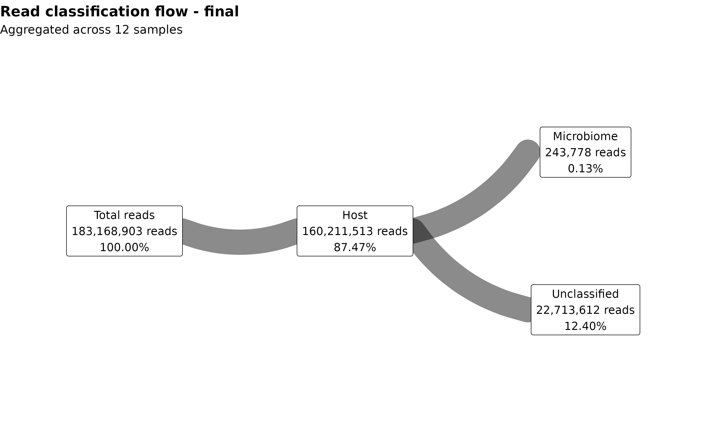

Use this plot to inspect the broad balance among host-classified reads,
microbiome-classified reads, and unclassified reads.

A sample with very different proportions from the rest of the dataset may need
extra inspection before biological interpretation.

### Read composition percentage barplot

This plot shows read-composition percentages per sample.

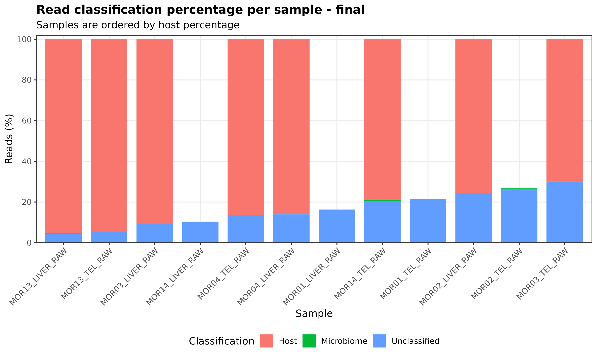

Use this plot to compare samples directly.

For example, one sample may have much more host signal, much less microbiome
signal, or a much larger unclassified fraction than the others.

These patterns can reflect biology, sample quality, sequencing depth, database
coverage, or technical differences.

### Read composition outlier plot

This plot highlights samples with unusual read-composition behavior.

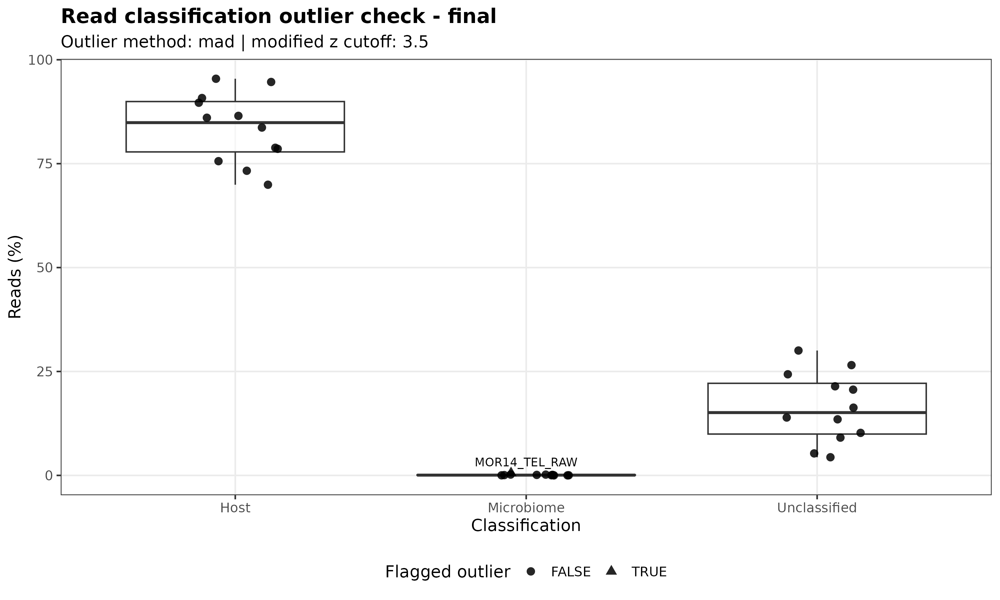

Outlier samples are not automatically wrong.

They should be inspected carefully using the run log, [Kraken2][kraken2]
reports, sample metadata, and quality-control outputs.

### What not to conclude

Do not remove a sample only because it appears different in these plots.

Do not interpret a high microbiome-classified fraction as proof of infection or
biological association by itself.

Do not interpret a high unclassified fraction as a pipeline failure without
checking read quality, database choice, host filtering, and taxonomic reports.

These plots are quality-control and interpretation aids, not final biological
evidence.


## Stacked bar plots

Stacked bar plots provide a first visual overview of the taxonomic profile of
each sample.

They are useful for identifying dominant taxa, comparing broad abundance
patterns among samples, and detecting samples with unusual taxonomic
composition.

### Output location

Stacked bar plots are stored under:

```text
exploratory/taxonomy/stacked_bar/
```

For the default species rank, the main folders are:

```text
exploratory/taxonomy/stacked_bar/species_absolute/
exploratory/taxonomy/stacked_bar/species_relative/
```

### Absolute abundance stacked bar

The absolute abundance stacked bar shows the abundance values before converting
each sample to percentages.

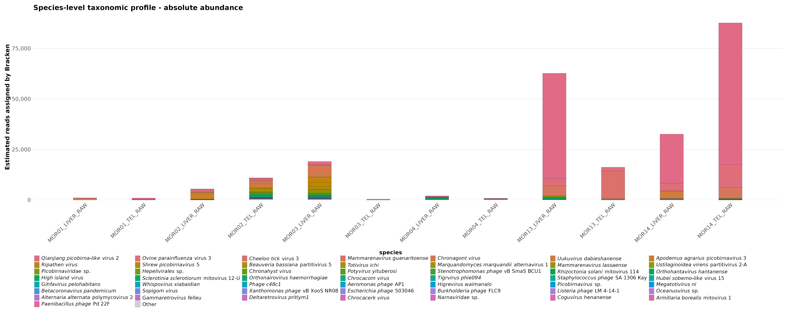

Use this plot to inspect whether some samples have much larger taxonomic signal
than others.

Large differences in total abundance may reflect biological differences,
sequencing depth, host-filtering behavior, database composition, or technical
variation.

### Relative abundance stacked bar

The relative abundance stacked bar shows the taxonomic composition after
normalizing each sample to percentages.

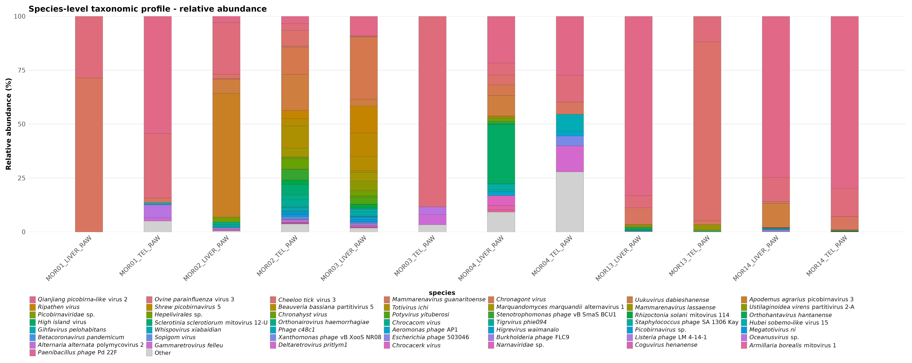

Use this plot to compare the proportional composition of samples.

This can make sample-to-sample composition easier to compare, but it also hides
differences in total abundance.

### How to interpret stacked bar plots

Each bar represents one sample.

Each colored segment represents one detected taxon or a grouped category such
as “Other”, depending on the plotting threshold.

A taxon occupying a large part of a bar is dominant in that sample.

A taxon appearing across many bars is recurrent across samples.

A sample with a very different stacked profile from the others may need closer
inspection in the [Kraken2][kraken2] reports, [Bracken][bracken] abundance
tables, and read-composition QC outputs.

### Absolute vs relative abundance

Absolute abundance and relative abundance answer different questions.

Absolute abundance asks:

```text
How much taxonomic signal was detected for this sample?
```

Relative abundance asks:

```text
Among the detected taxa in this sample, what proportion belongs to each taxon?
```

Both views are useful.

A taxon can look dominant in relative abundance even when the total number of
detected reads is low.

For that reason, relative abundance plots should be interpreted together with
absolute abundance plots and read-composition QC.

### What not to conclude

Do not interpret a dominant stacked-bar segment as proof of infection,
contamination, or biological causality by itself.

Do not compare relative abundance without checking whether samples have very
different total read counts or microbiome-classified fractions.

Do not treat the “Other” category as unimportant automatically. It may contain
many low-abundance taxa grouped together for readability.


## Taxonomic heatmaps

Taxonomic heatmaps show abundance patterns across samples and taxa.

They are useful for identifying sample clustering, dominant taxa, taxa shared
across samples, and samples with unusual abundance profiles.

MTD Explorer generates these plots using [pheatmap][pheatmap].

### Output location

Taxonomic heatmaps are stored under:

```text
exploratory/taxonomy/heatmap/
```

For the default species rank, the main folders are:

```text
exploratory/taxonomy/heatmap/species_absolute/
exploratory/taxonomy/heatmap/species_relative/
```

### Absolute abundance heatmap

The absolute abundance heatmap shows taxonomic abundance before converting each
sample to percentages.

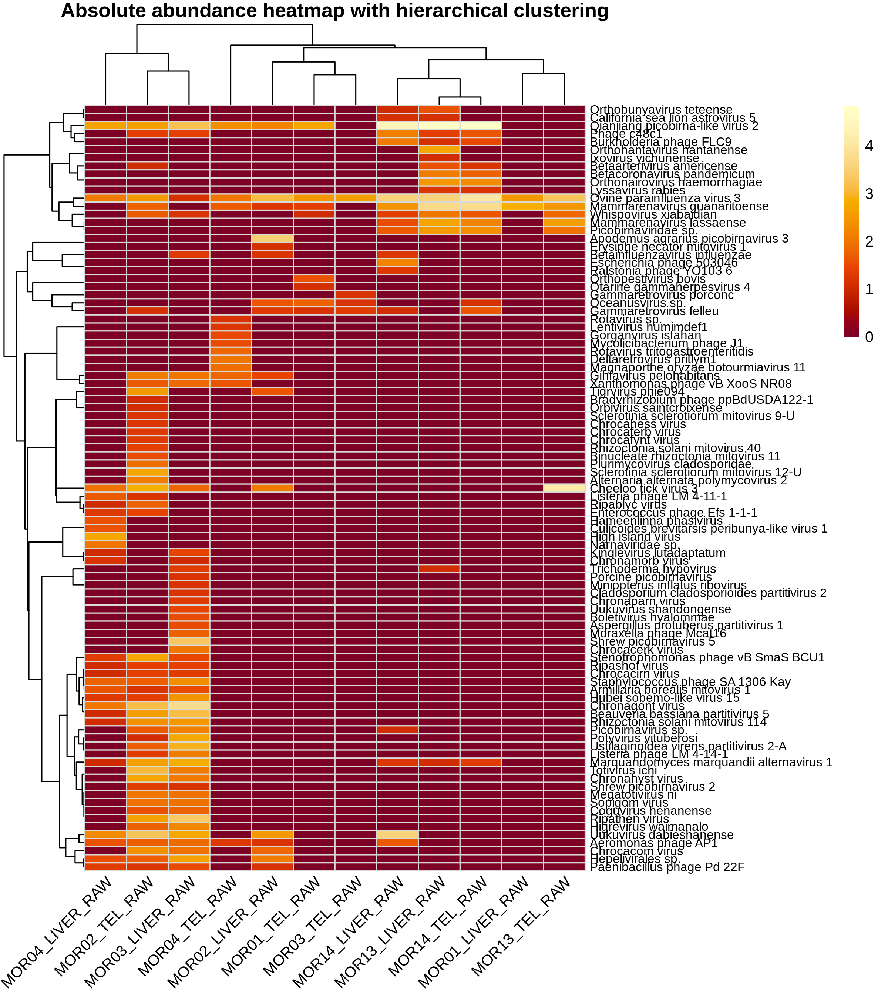

Use this plot to inspect whether some samples have stronger overall taxonomic
signal than others.

A sample with many high-abundance taxa may appear visually different from
samples with weak or sparse taxonomic signal.

### Relative abundance heatmap

The relative abundance heatmap shows abundance after normalizing each sample to
relative composition.

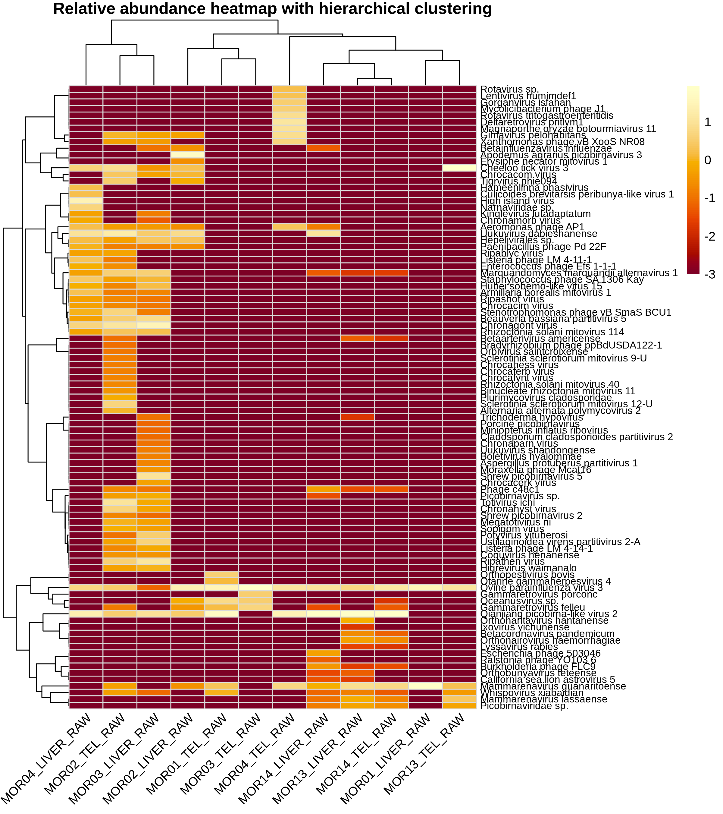

Use this plot to compare taxonomic composition among samples after reducing the
effect of total abundance differences.

This can make compositional patterns easier to see, but it can also hide
differences in the total amount of detected microbiome signal.

### How to read the heatmap

Each column usually represents one sample.

Each row represents one detected taxon.

The color intensity represents abundance.

Clustering groups together samples or taxa with similar abundance patterns.

Samples that cluster together have more similar taxonomic profiles according to
the abundance matrix used for the plot.

Taxa that cluster together have similar patterns across samples.

### Absolute vs relative heatmaps

Absolute and relative heatmaps answer different questions.

Absolute heatmaps ask:

```text
Which samples have stronger or weaker detected taxonomic signal?
```

Relative heatmaps ask:

```text
Do samples have similar taxonomic composition after normalization?
```

Both views are useful.

A taxon may look dominant in the relative heatmap even if the absolute number
of classified reads is low.

For that reason, relative heatmaps should be interpreted together with absolute
heatmaps, stacked bar plots, and read-composition QC.

### What not to conclude

Do not interpret heatmap clustering as proof of biological group separation by
itself.

Do not assume that a cluster is meaningful without checking sample metadata,
read composition, [Kraken2][kraken2] reports, [Bracken][bracken] abundance
tables, and sequencing depth.

Do not overinterpret low-abundance taxa that appear visually strong after row
scaling or relative normalization.


## Prevalence-abundance landscape

The prevalence-abundance landscape summarizes how widespread and abundant each
detected taxon is across the dataset.

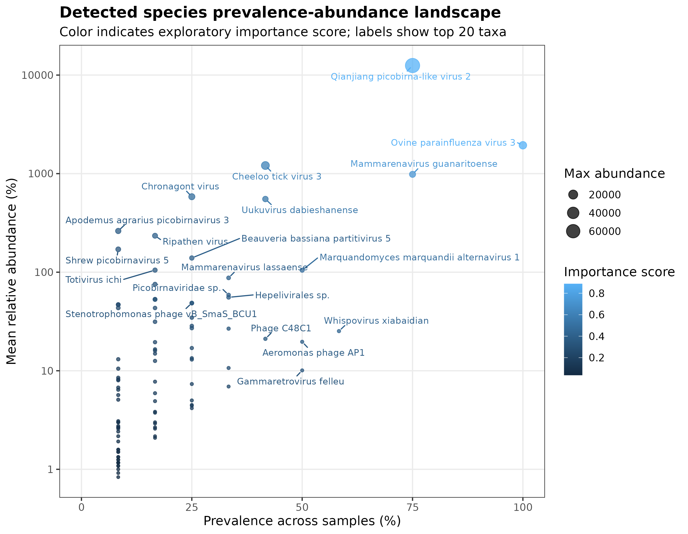

### Output location

This plot is generated under:

```text
exploratory/taxonomy/detected_microbiome/
```

For the default species rank and absolute mode, look for:

```text
exploratory/taxonomy/detected_microbiome/species_absolute_with_samples_distribution/
```

The example image used in this documentation corresponds to:

```text
detected_microbiome_species_prevalence_abundance_importance_landscape.png
```

### How to read the plot

The x-axis shows prevalence across samples.

Prevalence answers this question:

```text
In what percentage of samples was this taxon detected?
```

The y-axis shows mean abundance.

Mean abundance answers this question:

```text
How abundant is this taxon on average across the dataset?
```

The point size represents maximum abundance.

A large point means that the taxon reached high abundance in at least one
sample.

The point color represents the exploratory importance score.

A higher score means that the taxon ranked higher according to the descriptive
ranking used by [MTD Explorer][mtd-explorer].

### Common patterns

Taxa in the upper-right region are usually the most consistent high-abundance
detections. They appear in many samples and have relatively high average
abundance.

Taxa in the upper-left region may be abundant but restricted to a small number
of samples. These can represent sample-specific signals, rare high-abundance
events, or possible outlier behavior.

Taxa in the lower-right region are widespread but low abundance. These may
represent recurrent low-level detections.

Taxa in the lower-left region are low prevalence and low abundance. These are
usually weaker exploratory signals and should be interpreted with extra
caution.

### What not to conclude

Do not interpret this plot as proof that a taxon is biologically important.

Do not interpret a high abundance in one sample as evidence of infection,
contamination, or host association without additional evidence.

Do not compare groups using this plot alone.

## Detected microbiome importance ranking

The detected microbiome ranking plot shows the top taxa ranked by exploratory
importance score.

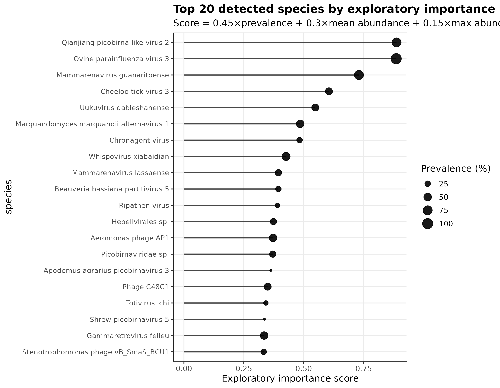

### Output location

This plot is generated under:

```text
exploratory/taxonomy/detected_microbiome/
```

For the default species rank and absolute mode, look for:

```text
exploratory/taxonomy/detected_microbiome/species_absolute_with_samples_distribution/
```

The example image used in this documentation corresponds to:

```text
top20_detected_microbiome_species_importance_lollipop.png
```

### How to read the plot

The x-axis shows the exploratory importance score.

Higher values indicate taxa that rank higher according to the descriptive
scoring formula used by [MTD Explorer][mtd-explorer].

The y-axis lists the top detected taxa.

The point size represents prevalence.

Larger points indicate taxa detected in a larger percentage of samples.

### How the score is used

The score is a descriptive ranking designed to combine taxon-level properties
such as prevalence and abundance.

It helps prioritize taxa for inspection.

It is not a statistical p-value.

It is not a false-discovery-rate-adjusted result.

It is not a differential abundance test.

### What this plot is useful for

This plot is useful for quickly identifying taxa that are:

- detected across many samples;
- abundant in the dataset;
- potentially worth inspecting in the raw reports;
- candidates for downstream validation or discussion.

### What not to conclude

Do not call the top-ranked taxa “significant” based only on this plot.

Do not treat this score as evidence of infection.

Do not assume that a taxon is biologically meaningful without checking the
underlying reads, classification context, database design, sample metadata, and
study design.

## Relationship between the two plots

The prevalence-abundance landscape shows the distribution of detected taxa.

The importance ranking plot summarizes the highest-ranking taxa.

Use them together:

1. inspect where a taxon appears in the prevalence-abundance landscape;
2. check whether it appears in the top ranking;
3. inspect the corresponding ranked table;
4. review per-sample [Kraken2][kraken2] reports when needed;
5. interpret results in the context of the database and experimental design.

## Core microbiome

Core microbiome outputs summarize which taxa are detected across increasing
prevalence thresholds.

They help identify taxa that are recurrent across many samples instead of taxa
that appear only in one or a few samples.

### Output location

Core microbiome outputs are stored under:

```text
exploratory/taxonomy/core_microbiome/
```

For the default species rank, the main folders are:

```text
exploratory/taxonomy/core_microbiome/species_absolute/
exploratory/taxonomy/core_microbiome/species_relative/
```

The main PNG files are:

```text
core_microbiome_species_absolute.png
core_microbiome_species_relative.png
```

### Absolute core microbiome

The absolute core microbiome plot uses the absolute abundance table.


Use this plot to inspect how many taxa remain detectable as the prevalence
threshold becomes stricter.

A taxon detected at a high prevalence threshold is present in many samples.

A taxon detected only at low prevalence thresholds is more sample-specific or
less recurrent.

### Relative core microbiome

The relative core microbiome plot uses the relative abundance table.

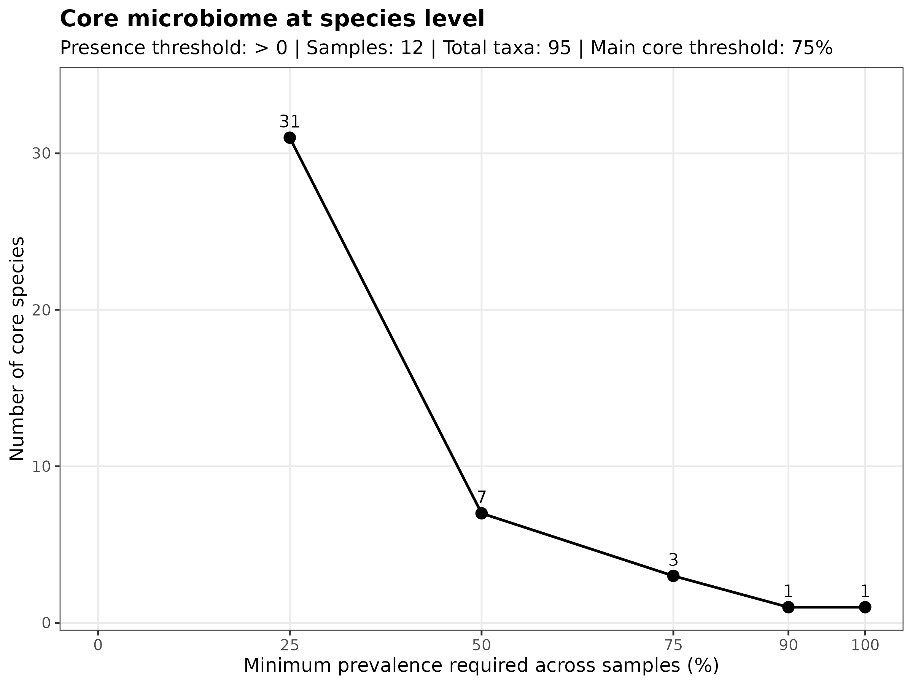

Use this plot to inspect recurrent taxa after sample-level abundance
normalization.

This view can make recurrent compositional patterns easier to see, but it
should still be interpreted together with absolute abundance and read
composition QC.

### How to interpret prevalence thresholds

MTD Explorer uses several prevalence thresholds, such as:

```text
25%
50%
75%
90%
100%
```

A taxon present at the `25%` threshold was detected in at least one quarter of
the samples.

A taxon present at the `75%` threshold was detected in at least three quarters
of the samples.

A taxon present at the `100%` threshold was detected in all samples.

### What this output is useful for

Core microbiome plots are useful for identifying taxa that are:

- recurrent across many samples;
- not driven by a single outlier sample;
- useful candidates for follow-up inspection;
- potentially important for describing the common taxonomic profile of the
  dataset.

### What not to conclude

Do not interpret core membership as proof that a taxon is biologically
essential, host-associated, or functionally important.

Do not assume that taxa absent from the core are irrelevant.

A taxon may be biologically interesting even if it is detected in only a subset
of samples, especially in tissue-specific, condition-specific, infection-like,
or environmental exposure contexts.

Core microbiome results depend on detection thresholds, sample size, database
choice, sequencing depth, and filtering behavior.


## Detected species pie by phylum

The detected species pie chart summarizes detected species according to broader
taxonomic categories.

In the default species-level exploratory workflow, this plot is used to show
which higher-level taxonomic groups contribute most to the detected species
list.

### Output location

Detected species pie outputs are stored under:

```text
exploratory/taxonomy/detected_microbiome_pie/
```

For the default species-level workflow, the main folder is:

```text
exploratory/taxonomy/detected_microbiome_pie/species_by_phylum/
```

The main PNG file is usually:

```text
detected_species_by_auto_level.png
```

### Pie chart

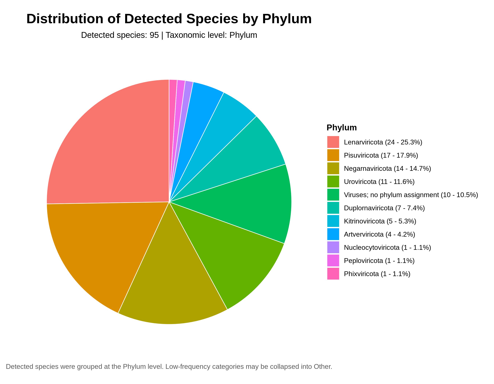

### How to read the plot

Each slice represents a broader taxonomic category assigned to detected
species.

Larger slices indicate that more detected species belong to that category.

This plot is useful for quickly seeing whether the detected species list is
dominated by a small number of broad taxonomic groups.

### What this plot is useful for

Use this plot to inspect:

- which broad groups dominate the detected species list;
- whether the detected profile is taxonomically diverse or concentrated;
- whether unexpected groups appear among detected species;
- whether the detected species list matches the biological context and database
  design.

### Important limitation

This plot summarizes the number or contribution of detected species by broad
category.

It should not be interpreted as a direct abundance plot unless the figure label
and source table clearly indicate that abundance weighting was used.

A large slice can mean that many detected species belong to that group, not
necessarily that the group has the highest read abundance.

### What not to conclude

Do not interpret a large slice as proof that a broad taxonomic group dominates
the biological sample.

Do not treat this plot as evidence of infection, contamination, or host
association by itself.

Do not use this plot alone to compare groups.

For interpretation, check the ranked detected-microbiome table, abundance
tables, [Kraken2][kraken2] reports, [Bracken][bracken] outputs, and
read-composition QC.


## Species overlap

Species overlap plots summarize which detected species are shared between two
groups and which species are detected only in one group.

These outputs are generated when the samplesheet contains exactly two groups.

### Output location

Species overlap outputs are stored under:

```text
exploratory/taxonomy/species_overlap/
```

The generated filenames include the comparison labels and may vary depending on
the group names in the samplesheet.

Typical PNG files include:

```text
*_venn.png
*_euler.png
```

### Venn diagram

The Venn diagram shows the count of detected species shared between groups and
the count of species detected only in each group.

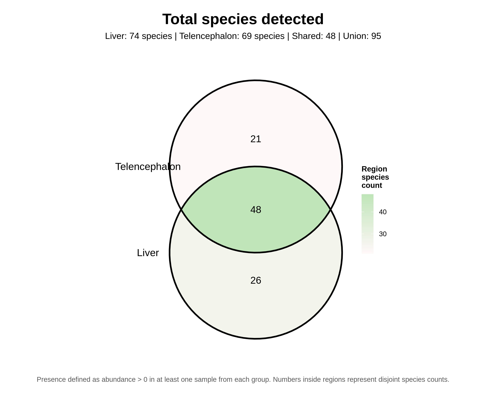

Use this plot to quickly inspect whether the two groups have mostly shared
detected species or whether each group has many group-specific detections.

### Euler diagram

The Euler diagram shows the same overlap idea, but the circle areas are fitted
to better represent the relative sizes of the sets.

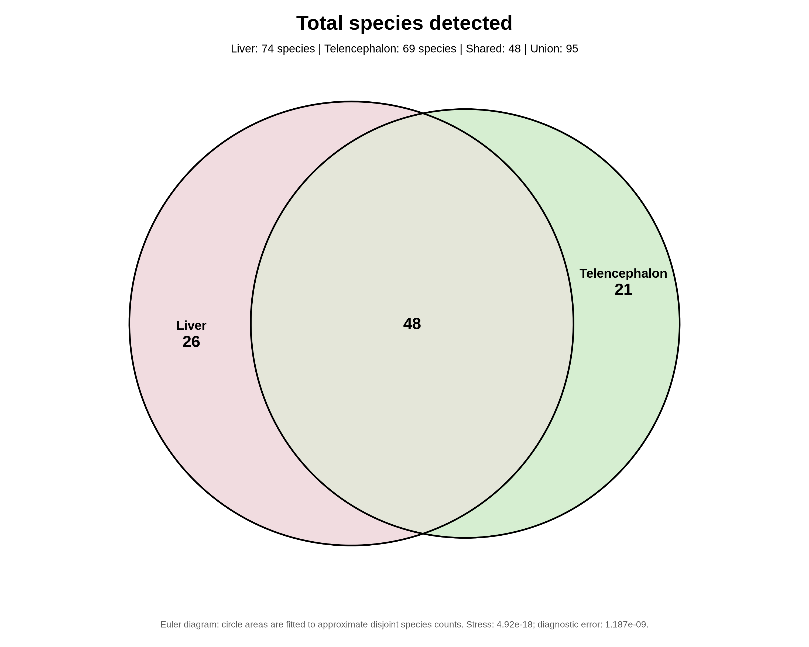

MTD Explorer generates this plot using [eulerr][eulerr].

The Euler diagram can be visually useful, but it may not perfectly represent
all set relationships when the data are difficult to fit geometrically.

### Venn vs Euler

A Venn diagram prioritizes set structure.

An Euler diagram tries to make the area of each region more proportional to the
observed counts.

For simple two-group species overlap, both plots should tell the same general
story:

```text
group 1 only
shared between groups
group 2 only
```

### How to interpret species overlap

Shared species are detected in both groups.

Group-specific species are detected in only one group.

A large shared region suggests that the two groups have many detected taxa in
common.

A large group-specific region suggests that one group has many detected taxa
not observed in the other group.

### What not to conclude

Do not interpret group-specific detection as proof of differential abundance.

Do not interpret group-specific detection as proof that a species is biologically
exclusive to that group.

Do not treat the overlap plot as a statistical test.

A species can appear group-specific because of sample size, sequencing depth,
read filtering, abundance threshold, database coverage, sparse detection, or
technical variation.

For biological interpretation, inspect the abundance table, read-composition
QC, [Kraken2][kraken2] reports, [Bracken][bracken] outputs, and the study
metadata.

### When this output may be missing

Species overlap plots may be absent when:

- the samplesheet has fewer than two groups;
- the samplesheet has more than two groups;
- one or both groups have no detected species after filtering;
- the taxonomic abundance table is missing;
- the plotting step failed but the pipeline continued with a warning.

Check this folder for logs:

```text
exploratory/taxonomy/logs/
```


## Alpha diversity

Alpha diversity summarizes taxonomic diversity within each sample.

These outputs help users compare how rich, even, or diverse the detected
microbiome profile is across samples or groups.

### Output location

Alpha diversity outputs are stored under:

```text
exploratory/taxonomy/alpha_diversity/
```

For the default species-rank exploratory workflow, the main folder is:

```text
exploratory/taxonomy/alpha_diversity/species_relative/
```

The main PNG files are:

```text
alpha_diversity_species_relative_faceted.png
alpha_diversity_species_relative_observed_taxa.png
alpha_diversity_species_relative_shannon.png
alpha_diversity_species_relative_simpson.png
alpha_diversity_species_relative_inverse_simpson.png
alpha_diversity_species_relative_pielou_evenness.png
```

### Faceted alpha diversity overview

The faceted alpha diversity plot shows multiple diversity metrics together.

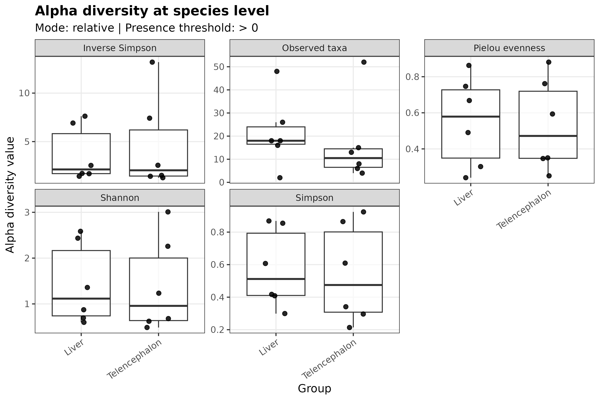

Use this plot as the first overview.

It helps compare whether the same samples or groups show similar patterns
across different alpha diversity metrics.

### Observed taxa

Observed taxa counts how many taxa were detected in each sample.

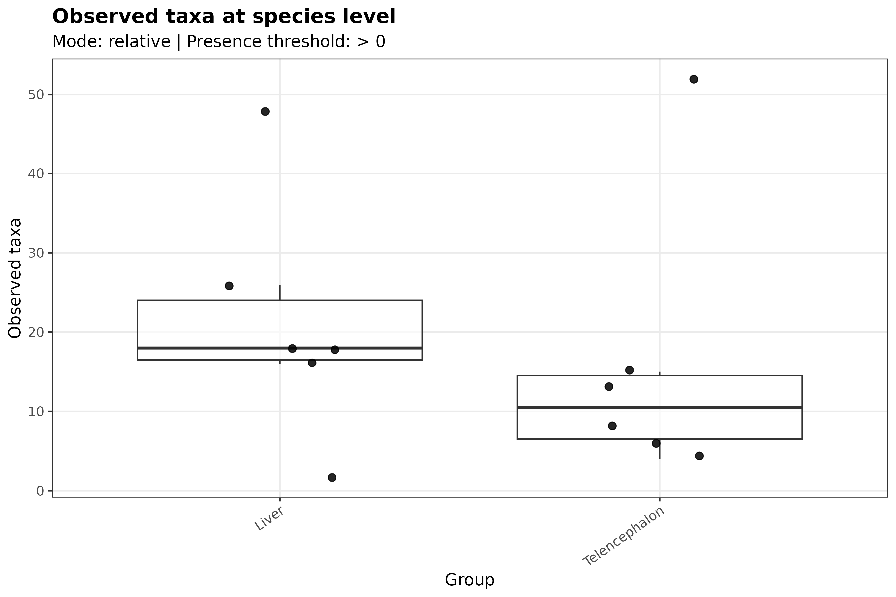

This is a richness measure.

Higher values indicate that more taxa were detected in that sample.

Observed taxa is easy to interpret, but it is sensitive to sequencing depth,
filtering, database coverage, and detection thresholds.

### Shannon diversity

Shannon diversity combines richness and evenness.

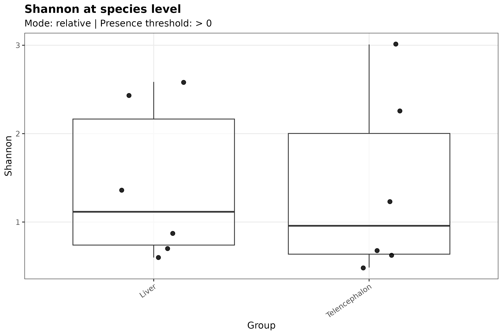

Higher Shannon values usually indicate that a sample has more taxa and/or a
more even distribution among taxa.

A sample dominated by one taxon can have lower Shannon diversity even if
several other taxa are present at low abundance.

### Simpson diversity

Simpson diversity emphasizes dominance.

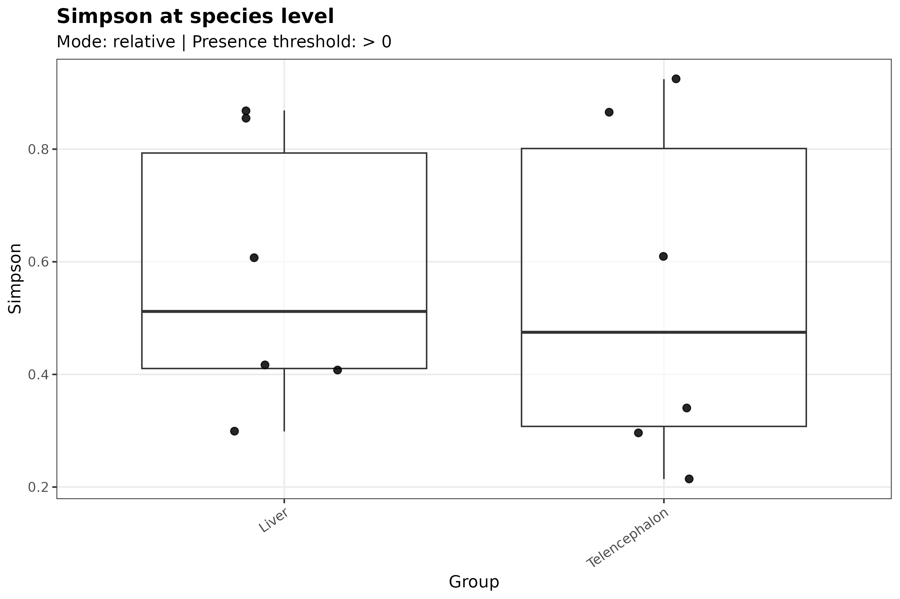

Depending on the exact formulation, Simpson-related metrics can increase or
decrease with dominance.

In MTD Explorer, interpret this plot together with the axis label and the
corresponding output table.

### Inverse Simpson diversity

Inverse Simpson diversity is another dominance-sensitive diversity metric.

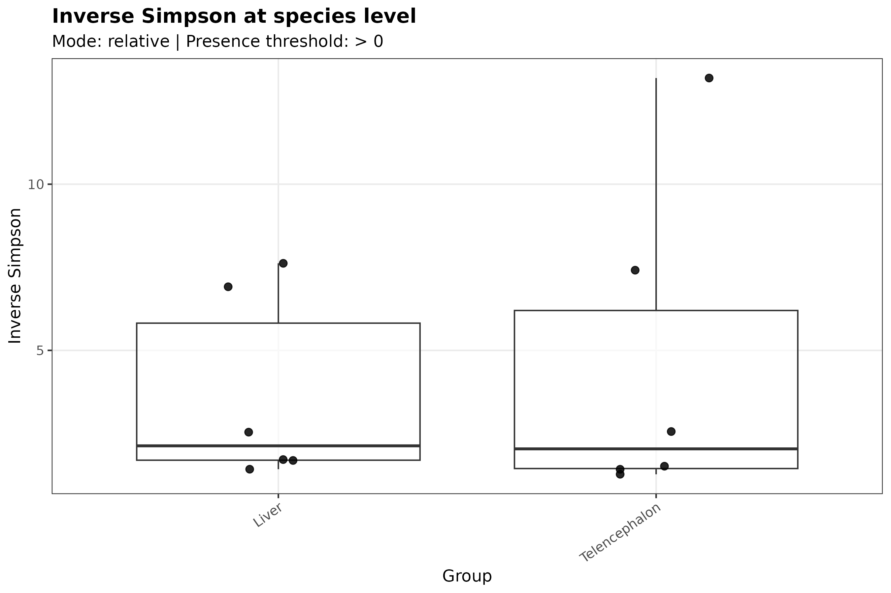

Higher values generally indicate greater diversity, with less dominance by one
or a few taxa.

### Pielou evenness

Pielou evenness measures how evenly abundance is distributed among detected
taxa.

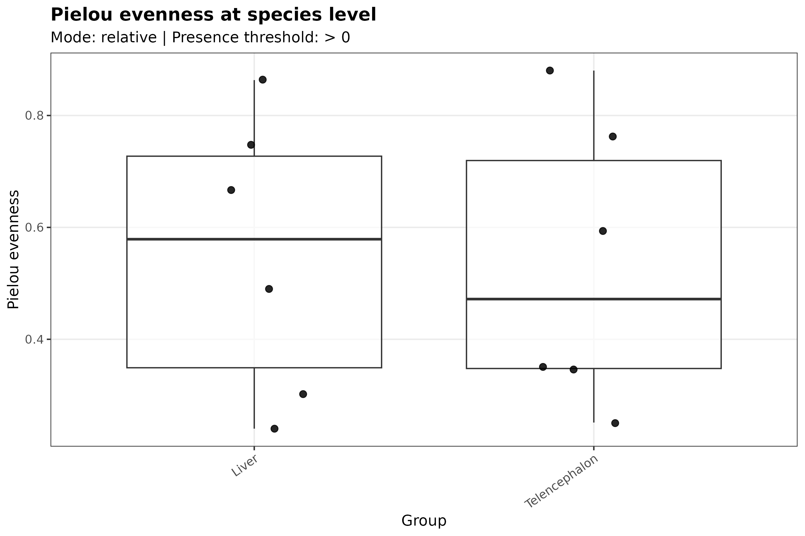

Higher values indicate that detected taxa have more similar abundances.

Lower values suggest that one or a few taxa dominate the profile.

### How to interpret alpha diversity

Alpha diversity answers questions such as:

```text
How many taxa are detected within each sample?
```

```text
Are detected taxa evenly distributed or dominated by a few taxa?
```

```text
Do some samples or groups appear more taxonomically diverse than others?
```

Use alpha diversity together with stacked bar plots, heatmaps,
read-composition QC, and abundance tables.

### What not to conclude

Do not interpret alpha diversity differences as proof of biological group
differences without statistical testing and appropriate study design.

Do not interpret low diversity as poor data quality automatically.

Do not interpret high diversity as better, healthier, or more biologically
important by default.

Alpha diversity can be affected by sequencing depth, host read fraction,
database choice, taxonomic rank, abundance filtering, contamination, and sparse
microbial signal.

### When this output may be missing

Alpha diversity outputs may be absent when:

- the abundance table is missing;
- too few taxa are detected;
- too few samples are available;
- the matrix is too sparse;
- the plotting step failed but the pipeline continued with a warning.

Check this folder for logs:

```text
exploratory/taxonomy/logs/
```


## Beta diversity

Beta diversity summarizes differences in taxonomic composition between
samples.

While alpha diversity describes diversity within each sample, beta diversity
asks whether samples have similar or different taxonomic profiles.

### Output location

Beta diversity outputs are stored under:

```text
exploratory/taxonomy/beta_diversity/
```

For the default species-rank exploratory workflow, the main folder is:

```text
exploratory/taxonomy/beta_diversity/species_relative/
```

The main PNG files are usually:

```text
beta_diversity_species_relative_pcoa_bray.png
beta_diversity_species_relative_nmds_bray.png
```

The default exploratory beta-diversity distance is Bray-Curtis.

### PCoA ordination

Principal coordinates analysis, or PCoA, represents samples in a low-dimensional
space based on their pairwise taxonomic dissimilarities.

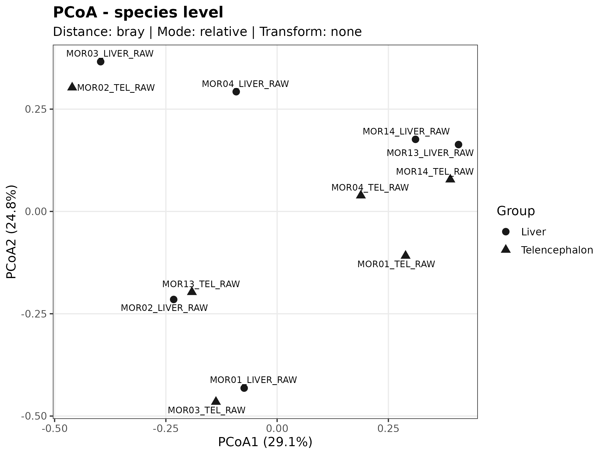

Samples closer together have more similar taxonomic profiles according to the
distance matrix used for the plot.

Samples farther apart have more different taxonomic profiles.

The axis labels usually indicate how much variation is represented by each
ordination axis.

### NMDS ordination

Non-metric multidimensional scaling, or NMDS, is another ordination method used
to represent sample dissimilarities.

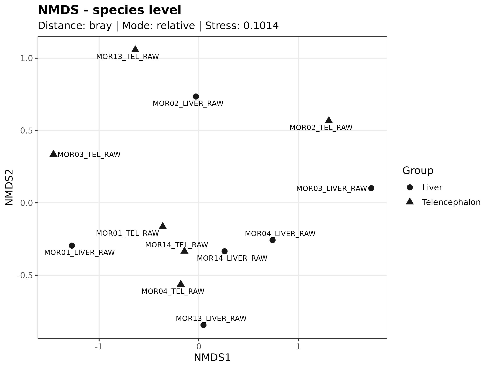

NMDS focuses on preserving the rank order of distances between samples.

Samples that appear close together have more similar taxonomic profiles than
samples that appear far apart.

### PCoA vs NMDS

PCoA and NMDS are complementary.

PCoA provides axes with interpretable explained variation when supported by the
distance matrix.

NMDS focuses on preserving relative dissimilarity ranks and can be useful for
complex ecological abundance data.

If both plots show similar sample grouping, the pattern is more visually
consistent.

If the plots disagree, interpret cautiously and inspect the abundance matrix,
read composition, sample metadata, and outlier behavior.

### How to interpret beta diversity

Beta diversity helps answer questions such as:

```text
Do samples have similar taxonomic composition?
```

```text
Are some samples compositionally distinct from the rest?
```

```text
Do samples from the same group appear closer together than samples from
different groups?
```

These plots are exploratory visualizations.

They can suggest patterns, but they do not prove statistical separation between
groups by themselves.

### What not to conclude

Do not interpret visual clustering as proof of biological group separation
without statistical testing and appropriate study design.

Do not overinterpret separation driven by one outlier sample.

Do not assume that distance between samples is caused by biology alone.

Beta diversity can be affected by sequencing depth, host read fraction,
database choice, taxonomic rank, abundance filtering, sparse taxa, and
contamination.

### When this output may be missing

Beta diversity outputs may be absent when:

- the abundance table is missing;
- too few samples are available;
- too few taxa are detected;
- the matrix is too sparse;
- the ordination failed;
- the plotting step failed but the pipeline continued with a warning.

Check this folder for logs:

```text
exploratory/taxonomy/logs/
```


## Microbiome abundance matrix QC

Microbiome abundance matrix QC summarizes the structure of the taxonomic
abundance matrix used for exploratory microbiome analysis.

These outputs help users inspect whether the microbiome matrix contains enough
signal for interpretation, whether samples cluster unexpectedly, and whether
some samples have unusually sparse or unusual profiles.

### Output location

Microbiome abundance matrix QC outputs are stored under:

```text
exploratory/taxonomy/microbiome_abundance_qc/
```

For the default species-rank exploratory workflow, the main folder is:

```text
exploratory/taxonomy/microbiome_abundance_qc/species_relative/
```

The main PNG files are usually:

```text
microbiome_species_pca.png
microbiome_species_top_variable_heatmap.png
microbiome_species_sample_correlation_heatmap.png
microbiome_species_detected_features_per_sample.png
```

### PCA of microbiome abundance matrix

The PCA plot summarizes the main axes of variation in the microbiome abundance
matrix.

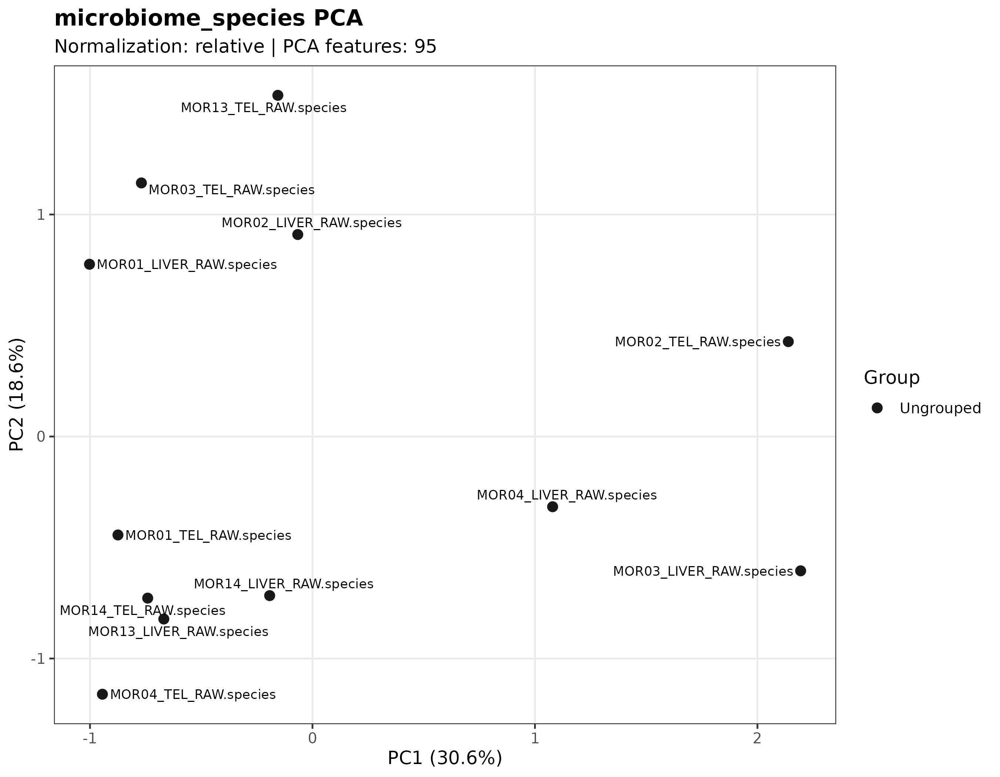

Samples that appear close together have more similar abundance profiles
according to the transformed matrix used for this QC step.

Samples far from the main cluster may represent biological differences,
technical variation, low microbiome signal, unusual read composition, or
outlier behavior.

### Top variable taxa heatmap

The top variable taxa heatmap shows the taxa with the strongest variation
across samples.

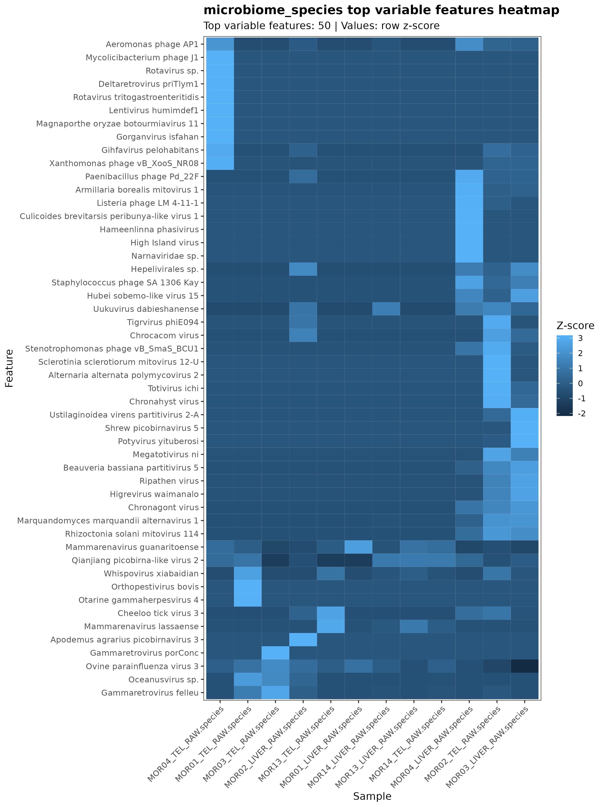

Use this plot to inspect which taxa contribute most strongly to differences
among samples.

This heatmap can help identify whether variation is driven by many taxa or by a
small number of highly variable taxa.

### Sample correlation heatmap

The sample correlation heatmap summarizes similarity among samples based on
their microbiome abundance profiles.

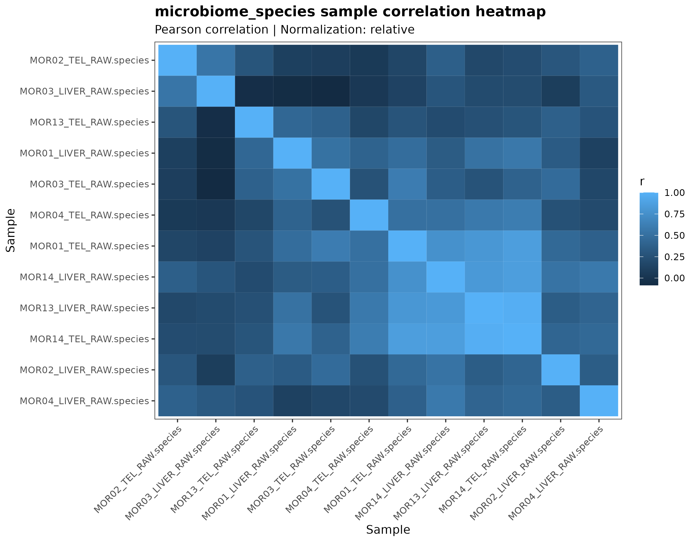

Samples with high correlation have similar taxonomic abundance profiles.

Samples with low correlation compared with the rest of the dataset may need
closer inspection.

### Detected features per sample

The detected features plot shows how many taxa or features were detected in
each sample.

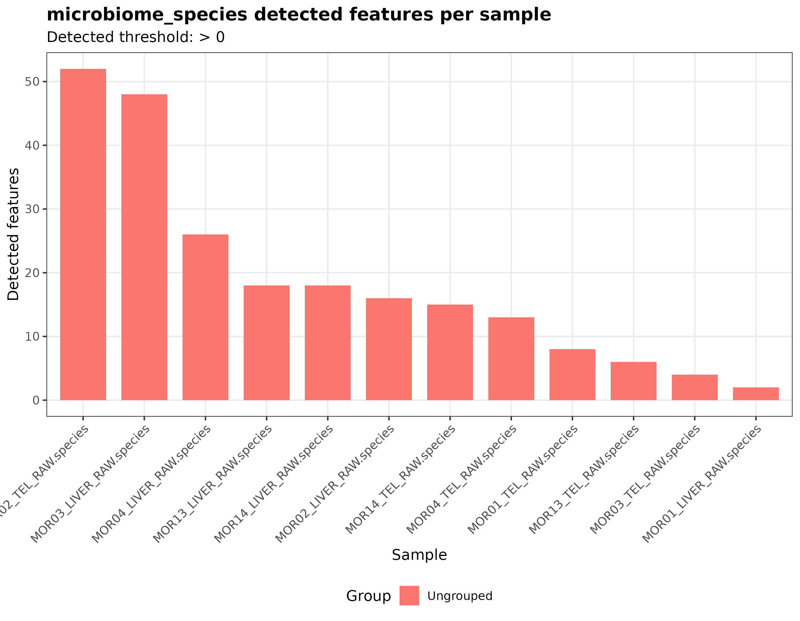

Use this plot to identify samples with unusually few or unusually many detected
taxa.

Very low detected-feature counts may indicate low microbiome signal, strong
host dominance, sparse classification, strict filtering, or database mismatch.

### How to interpret this QC block

This QC block helps answer questions such as:

```text
Do samples have enough detected microbiome features for interpretation?
```

```text
Are some samples unusually sparse?
```

```text
Do samples cluster or correlate in a way that matches the study design?
```

```text
Is variation driven by many taxa or by a few dominant features?
```

Use these plots together with read-composition QC, stacked bar plots, heatmaps,
beta diversity, [Kraken2][kraken2] reports, and [Bracken][bracken] abundance
tables.

### What not to conclude

Do not interpret PCA separation as proof of biological group separation by
itself.

Do not remove a sample only because it appears unusual in one QC plot.

Do not interpret low detected-feature counts as pipeline failure without
checking read quality, host filtering, database choice, and taxonomic reports.

Do not interpret high sample correlation as proof that samples are biologically
identical.

These plots are quality-control and exploratory interpretation aids.

### When this output may be missing

Microbiome abundance matrix QC outputs may be absent when:

- the abundance table is missing;
- too few taxa are detected;
- too few samples are available;
- the matrix is too sparse;
- PCA or heatmap generation failed;
- the plotting step failed but the pipeline continued with a warning.

Check this folder for logs:

```text
exploratory/taxonomy/logs/
```


## Other taxonomic exploratory outputs

[MTD Explorer][mtd-explorer] also generates other taxonomic exploratory outputs
when the required input data are available.

These include:

| Output folder | Purpose |
|---|---|
| `heatmap/` | Taxonomic heatmaps for visualizing abundance patterns and sample clustering |
| `stacked_bar/` | Stacked bar plots showing dominant detected taxa across samples |
| `prevalence_abundance/` | Prevalence and abundance summaries |
| `core_microbiome/` | Taxa detected across prevalence thresholds |
| `species_overlap/` | Shared and group-specific detected species, usually for two-group datasets |
| `detected_microbiome_pie/` | Detected species summarized by broader taxonomic categories |
| `alpha_diversity/` | Within-sample diversity summaries |
| `beta_diversity/` | Between-sample taxonomic composition summaries |
| `microbiome_abundance_qc/` | Quality-control plots for the abundance matrix |
| `detected_microbiome_extracted_reads/` | Optional extracted reads for selected detected taxa |

These outputs will be documented in more detail as additional example figures
are added.

## Files to inspect first

For taxonomic exploratory interpretation, start with:

```text
exploratory/taxonomy/detected_microbiome/
exploratory/taxonomy/prevalence_abundance/
exploratory/taxonomy/heatmap/
exploratory/taxonomy/stacked_bar/
kraken/kraken_global_read_composition_final.tsv
kraken/reports_micro_final/
bracken_species_all
methods/mtd_methods_run_parameters.csv
```

The `methods/mtd_methods_run_parameters.csv` file is useful because it records
the selected database paths, read layout, [Kraken2][kraken2] parameters,
[Bracken][bracken] parameters, and software versions.

## When outputs may be missing

Some exploratory outputs may be absent when:

- the exploratory figure step was disabled;
- the selected rank has no detected taxa;
- the abundance table is missing;
- the matrix is too sparse;
- the samplesheet is missing or invalid;
- a plotting script failed but the pipeline continued with a warning;
- an output is generated only for a specific number of groups.

Check this folder for step-specific logs:

```text
exploratory/taxonomy/logs/
```

## Next step

After reviewing taxonomic exploratory outputs, inspect the broader
[Output files](output-files.md) page or continue to the
[Command-line reference](command-line.md).

[mtd-explorer]: https://github.com/patrick-douglas/MTD
[kraken2]: https://ccb.jhu.edu/software/kraken2/index.shtml
[bracken]: https://github.com/jenniferlu717/Bracken
[pheatmap]: https://cran.r-project.org/package=pheatmap
[eulerr]: https://cran.r-project.org/package=eulerr
[ggvenndiagram]: https://github.com/gaospecial/ggVennDiagram
